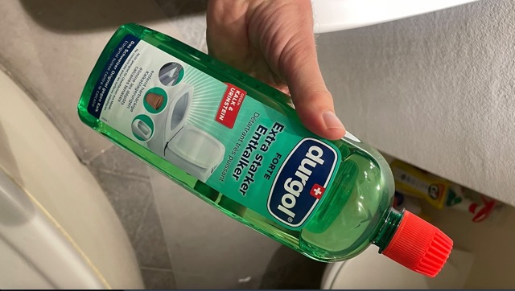

# Badezimmer

Hier lernst du alle "Tricks", für dein Badezimmer.

## Lavabo

### Entstopfen der Lavabo-Röhre

1) Kaufe dir einen _Abflussreiniger_, zum Beispiel [hier](https://www.galaxus.ch/de/s7/product/diaqua-abflussreiniger-reinigungsutensil-5851652?dbq=1&gclid=EAIaIQobChMIociYwtWX9AIVF-R3Ch29hg6EEAQYASABEgJzdvD_BwE&gclsrc=aw.ds)
2) Fülle das verstopfte Lavabo mit Wasser, wie in [diesem Youtube-Video](https://www.youtube.com/watch?v=UDxdY9-vAhw).
3) Dann bring den Abflussreiniger auf den Abfluss und pumpe das Wasser mit viel Druck in den Abfluss. Mache dies, bis der verstopfte Dreck rauskommt. 
4) Lasse viel Wasser aus dem Wasserhahn ins Becken. Es sollte nun nicht mehr verstopft sein :)

## WC

### Entkalkung von Urinstein: Anleitung

1) Nehme 1/4-Liter Essig und giesse es ins WC ([genau so](https://www.youtube.com/watch?v=kFKCiM7v-qk&t=1m17s)).
2) Anschliessend, nimmst du 2 Backpulver und giesst es auch ins WC ([genau so](https://www.youtube.com/watch?v=kFKCiM7v-qk&t=1m35s))
3) Nun heisst es warten, circa 5 bis 10 Minuten, damit die chemische Reaktion ihren Effekt ausübt.
4) Zu guter Letzt mit der Klo-Bürste alles abschrubben und die Spülung betätigen --> Tadah! :D 

### Tiefenreinigung WC: Durgol-Putzmittel

**Im Coop gibt es das Mittel namens "Durgol"**. Hier das Produkt:

**Anleitung (auf französisch)**: Pour le calcaire au fond de la cuvette des chiottes, c‘est le puissant Durgol en bouteille verte qu‘il faut acheter. Ce truc est ultra-efficace: 

1. Tu **pousses un peu le trop-plein d’eau de la cuve avec la brosse à chiottes**, pour éviter qu‘il n‘y ai trop d’eau au fond de la cuve. 
2. Tu **verses 1/3 de la bouteille de Durgol vert pur dans la cuvette**, 
3. Et puis **tu laisses agir 4h**. 

**(Erwartetes) Resultat**: Quand tu tireras la chasse au bout des 4h, le fond de la cuvette sera comme neuf ! Génial, et sans se fatiguer à gratter et autres...

## Putzen der gesamten Wohnung

Folgende Putz-Instrumente solltest du bereit haben:

- Staubsauger (im Keller),
- "Schüfferli & Wüscherli (beim Radiator in der nähe des Esstisches),
- Starke Taschenlampe von Tee, um den Boden zu beleuchten, da dieser sehhhr dunkel ist bei uns (beim Eingang),
- Feuchtaufnehmer mit langem Stab spezifisch für Parkett (neben Kleiderschrank im Schlafzimmer),
- Swiffer (in Schublade vom Fernsehmöbel),
- Cif-Putzmittel (vis-à-vis vom Bad verstaut im offenen Schrak),
- WC-Entkalker Putzmittel (vis-à-vis vom Bad verstaut im offenen Schrak),
- Schimmel-Entferner (vis-à-vis vom Bad verstaut im offenen Schrak),
- 4 verschiedene Schwämme vom Badezimmer (3 sind oben an Wandschrank im Bad & 1 bei  der Dusche),
- Harte Zahnbürste & Plastik-Behälter (oben am Wandschrank),
- Backpulver (neben Sofa im Schrank), 
- Putz-Essig (unten rechts im Schrank in der Küche),

Mit all diesen obigen Werkzeugen kannst du dich auf den "grossen Sonntagsputz" freuen. Ich würde die Wohnung in folgender Reihenfolge putzen:

1) Gazer Staub mittels Schüfferli & Wüscherli in kleine Schmutz-Haufen ansammeln, damit du mit dem Staubsauger alles aufsaugen kannst.
2) Die ganze Wohnung mit allen Zimmern staubsaugen.
3) Dann das Badezimmer staubsaugen.
4) Bad putzen:
  - Zuerst das Fenstersims,
  - Dann die Dusche,
  - Dann das Klo,
  - Dann das Möbel unter dem Lavabo
  - Dann das Innere des Lavabo,
  - Dann noch die Armaturen vom Lavabo und der Dusche.
5) Schimmel mit Zahnbürste & Backpulver attackieren im Bad (Dusche) & bei der Haustüre,
  - Warte bis es einwirkt: mache einen Timer während 1h.
6) Anti-Schimmel im Bad & bei der Haustüre damit weniger Schimmel-Attacken passieren in Zukunft

Tadah! :D Das geht etwa 3h, wenn du alles richtig machst... 

