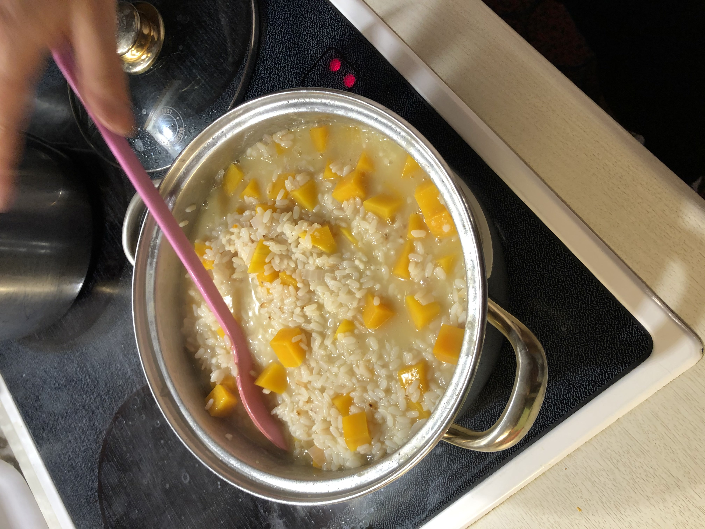
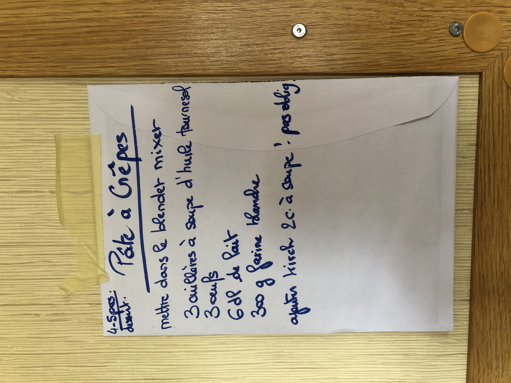
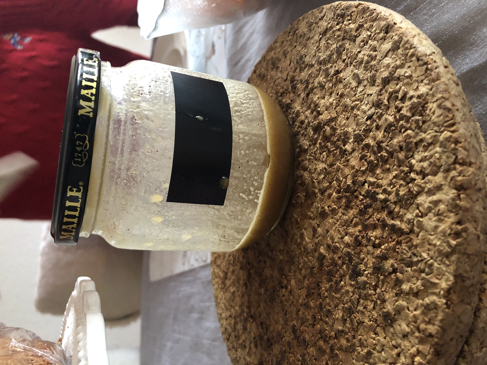

# Kochen

Hier geht es um alle Mahlzeiten, die ich bereits einmal zubereitet habe, damit du diese leicht replizieren kannst. Viel Spass beim Entdecken! =)

## Meine Kochdatenbank

### Mittagessen

- Brot + Chicoré + Tomaten 
  - <u>Option 1</u>: Käse
  - <u>Option 2</u>: Avocado
  - <u>Option 3</u>: gekochtes Ei
- Spaghetti
- Fischtäbli + Reis + Tomatensauce
- Spargeln + Kartoffeln
- Flammkuchen (= Speck + Crème-Fraîche + Zwiebeln)
  - <u>Optional</u>: Zucchetti
- Thonsalat (Rote Bohnen aus der Dose + Mais + Thon aus der Büchse + genug Mayonnaise + Essig + Öl!)
- Crêpes (= Mehl + Ei + Milch + Öl)
- Gebackene Tomaten mit Eifüllung (= Tomaten + Ei + Olivenöl + Balsamico-Essig)
  - <u>Einfachstes Kochbuch</u>: S. 162 
- Hörnlisalat
  - <u>Tiptopf</u>: S. 238

### Nachtessen

- Rösti + Speck + Spiegel-Ei
- Linsenbolognese (= rote Linsen + kleingeschnittene Karotte + Pelati Tomaten // geschälte Tomaten in der Dose gekocht) + Spaghetti
- Auberginen im Ofen "à la Joffrey" (= Mozarella-Scheiben + Tomensauce + Parmesan + Olivenöl)
- Linsen-Suppe "à la Dominique" (= grüne Linsen + Kartoffeln + Knollen-Sellerie + Buillon + Wasser + Lorbeerblatt + Nelken)
- Fischtäbli + Pommes + Spinat + Zitronen-Scheiben
- Frittiertes Poulet (Paniermehl + Ei!) + Pommes + Avocado-Dipp 
- Couscous (Karotten + Kichererbsen )
- Knoblauch-Brot (= Baguette + Knoblauch + Butter + Salz + Pfeffer + Zitronensaft)
- Taboulé 
  - <u>Tiptopf</u>: S. 236 
- Älplermakronen
  - <u>Tiptopf</u>: S. 243
- Pain au lait
  <u>Tiptopf</u>: S. 257

## Kürbis-Risotto

1. Zwiebeln & viel Butter in einer Pfanne anbraten lassen
2. Wenn Schritt 1) ready, dann 4*120g = 480g Riis in Pfanne mit Zwiebeln und Butter (ohne Wasser!) reintun.
  1. Parallel dazu 4*2.5 = 10 reiss-becher in separater pfanne leicht „anbrennen“ lassen
3. Wenn reiss langsam weiss wird, schritt für schritt wasser eingiessen. Wichtig: 7/10 wasser & 3/10 weisswein reingiessen.
4. 400 g Kürbis (in scheibchen geschnitten) beigeben
5. Rühren und immer mehr wasser reinrühren
6. 20 min sollte der risotto ready sein :D

## Crêpes

- <u>In Mixer Tun</u>:
  1. 100g de Mehl
  2. 1 Oeuf
  3. 2 dl Milch
  4. 3 Esslöffel d’huile (de tournesol)
  5. Optional: 2 Esslöfel Kirsch (für Verdauung)
    
- <u>Für 4 Personen</u>:

## Salat-Sauce

- <u>In Salatschüssel beigeben</u>:
  1. Olivenöl 
  2. Vinaigre de Melfore [= Essig] —> gleich viel, wie Olivenöl
  3. 1 Ess-Löffel Senf
  4. Salz & Pfeffer
—> alles mischen und tadahh!

## Thon-Salat (für 1+ Person)

- Mais & rote Bohnen aus der Büchse abwaschen unter kaltem Wasser.
- <u>In Salatschüssel beigeben</u>:
  1. Verhältnis von 55% Essig (Vinaigre de Melfort) und 45% Öl (huile de pepin de raisin). Ich denke, 2 Esslöffel reichen (nach 1 Versuch).
  2. Würze die Mischung mit Salz & Pfeffer.
  3. Thon aus der Büchse beigeben.
  4. Die gewaschenen Mais & rote Bohnen beigeben.
  5. Mayonnaise grosszügig beigeben (circa 1/3-tel).
-> alles mischen und tadaaahhh! =)

## Flamme-Kuchen (für 1 Person)

1. Teig auspacken (Anna's Best --> sind relativ klein, reicht circa für eine Person)
2. Crème Fraîche hinzufügen
  - <u>Regel</u>: ein kleiner 250ml Topf, reicht für 3 Flammes
3. Speckwürfel drüber streuen
4. Käse - zum Beispiel Gruyère - drüber raffeln
5. In den circa 240 C° heissen Ofen tun für 6min
--> Tadaaah! :D

## Steak 🥩:

1. Knoblauch vorbereiten, dh in feine Scheiben schneiden (ca. 3 Gouse d‘ail für 3 Personen)
2. Steak in Scheiben schneiden, ca. 2 cm breit
3. Sonnenblumenöl in Pfanne

## Pommes 🍟:

1. Allumer la Friteuse
2. Mettre les frites dans la friteuse
3. Mettre à 180 degrès
4. Mettre à 20 minutes

## Sauce Tomate (à la Tee) 🍅:

1. 2 Gousse D‘Ail schneiden, nicht zu dünn, sonst wird es verbrannt
2. Sonnenblumenöl in Pfanne giessen (genug, damit es nicht verbrennt)
3. Zwiebeln schneiden
4. Sel & Poivre hinzufügen
5. Nehme 1 ganze Tube Tomaten-Mark
6. Wasser beifügen, ca 1/5

## Ei-Omelette am Morrgen (1 Person):

1. 2 rohe Eier in eine Schüssel tun
2. Mit gabel das Eiweiss & Eigelb zusammenrühren
3. In Pfanne ein wenig Rapsöl giessen
4. Pfanne aufwärmen, dh warten, bis sie ein wenig warm wird
5. Vorbereitete Eier in Pfanne giessen
6. Eier braten für ca. 2-3 Minuten, bis es nicht mehr roh isch (nachdem es schon 2 Minzten am kochen ist, kannst du auch die Omellette falten, damit es schneller geht)

## Crème Patissière:

Dies eignet sich beispielsweise, wenn du Erdbeer-Cupcakes machst. Du kannst sie **im Migros oder Coop kaufen**.

1) Mache zuerst 200ml Schlagsahne (chantilly) mit Hilfe von Vollrahm.
2) In einem separatem Behälter: mische das Puder "Crème Patisserie" (siehe Bild oben) mit _200ml_ Wasser & Kirsch ODER Rhum.
  - <u>Trick</u>: Wenn du 200ml Wasser in eine Tasse gegossen hast, dann kannst du davon ein wenig wegwerfen und das dadurch fehlende Wasser mit Rhum oder Kirsch ersetzen.
3) Mische die Schlagsahne zur Wasser-Puder-Rhum-Mischung dazu et c'est fini!!!
4) Dann kannst du diese für deine Erdbeer-Cupcakes verwenden.
