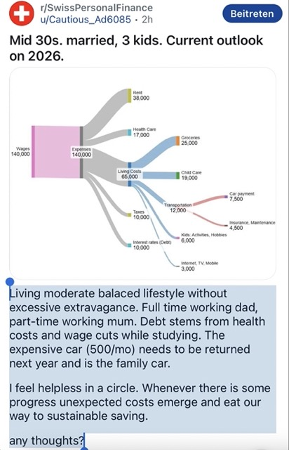
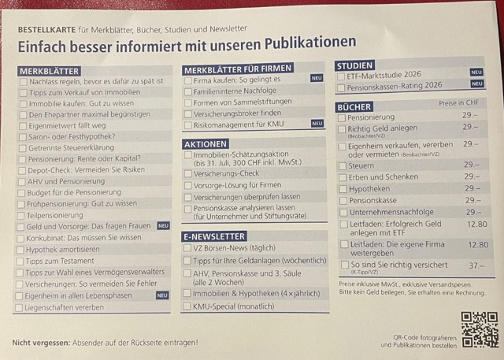

# Allgemeine Administration

Insbesondere sollten folgende Lebensbereiche von hoher Relevanz für dich sein:

- Bildung (z.B. Wahl der Studien-Richtung, Lern-Strategien, etc.),
- Finanzplanung (z.B. Haushaltspklanung, Steuern, Erbschaft, etc.),
- Investionen (z.B. Aktien, Immobilien, etc.),
- Gesundheit (z.B. Vorbeugung der Abschreibung deines Körpers),
- Wohnen (z.B. optimale Wohnortauswahl, Umzugs-Prozess, Immobilien-Verwaltung etc.),
- Betrieb eines Haushaltes,
- Familie (z.B. Erziehungsstrategie der Kinder, etc.)

*In diesem Kapitel zeige ich dir eine Liste an nützlichen Institutionen, die als wichtige Anlaufstellen in den obigen Lebensbereichen sein können und dich unterstützen können.*


## Betrieb des Haushaltes

### Post

Diese (globale) Institution gibt es in *jedem* Land und gewährleistet die Grundversorgung mit Postdiensten ([Schweizer Bund, 2026](https://www.uvek.admin.ch/de/strategische-ziele-fuer-die-post)).

#### Adresse des Empfängers

Vorname Name
Strasse + Strassen-Nummer
PLZ + Name der Ortschaft


#### Adresse des Absender 

Diese solltest du auf Rückseite eines Briefumschlags erfassen.

```Schreibe alles auf eine Linie, beginnend mit deinem Vorname, Name, Strasse und dann PLZ inkl. Ortschafts-Name!```

## Familienplanung

### Wie viel "kostet" eine 5-köpfige Familie in der Schweiz? | Eine monetäre Abschätzung

Hier ein Beispiel, wohin dein Geld abfliesst, **wenn du 3 (kleine) Kinder in der CH aufziehst mit 100% Arbeiten als Vater und Teilzeitarbeit als Mutter (beide ca. 35-jährig), pro Jahr**: 



Wie du siehst, sind die grossen Kostenblöcke:

- Miete,
- Krankenkasse,
- Essen,
- Kita,
- Mobilität (Auto hier),
- Steuern.

## Finanzplanung

### Vermögenszentrum

Dieses (unabhängige) Unternehmen ist ein führender Finanzdienstleister der Schweiz und hilft insbesondere bei **rechtlich-wirtschaftlichen Fragestellungen in der Schweiz**, beispielsweise:

- Investitionen:
  - Geld & Vorsorge: auch für Frauen
  - Tipps bei der Wahl eines Vermögensverwalters
- Versicherungen:
  - Fehlervermeidung beim Abschluss von *neuen* Versicherungen
  - Status-Quo Analyse deiner *aktuellen* Versicherungen
- Selbständigkeit:
  - Beratung bei Firmengründung
  - Firma kaufen: so gelingt es
  - Vorsorgelösungen bei eigener Firma
  - Risikomanagement für KMUs
  - Firmeninterne Nachfolge
  - Formen von Sammelstiftungen
- Heirat:
  - Beratung zum Konkubinat
- Immobilien:
  - Beratung zum Eigenheim in allen Lebensphasen
  - Schätzung des Wertes deiner Immobilie
  - Beratung bei Immobilienkauf (z.B. Saron- oder Festhypothek)
  - Immobilien Versteuerung (z.B. Eigenmietwert)
  - Hypothek amortisieren
- Steuern:
  - Getrennte Steuererklärungen
- Pensionierung:
  - Beratung zur AHV (auch für Selbständige!)
  - Beratung zur Frühpensionierung oder Teilpensionierung
  - Bezug einer Rente VS. Kapital
- Tod & Erbschaft:
  - Nachlassregelungen
  - Beratung zur Erstellung eines Testaments
  - Beratung bei Erstellung eines Erbvertrags für die Begünstigung des Ehepartners
  - Vererbung von Liegenschaften
  
Hier die Ursprungsquelle als Bild, die zur obigen Liste resultiert hat:



