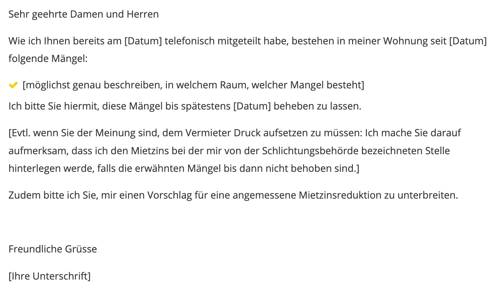

# Wohnen

Hier gebe ich dir alle nützlichen Tricks rund ums Thema Wohnen

## Wohnungs-Suche

- <u>Gute Website, die Wohnungen herausgibt</u>: https://flatfox.ch/de/

## Bewerbung

Um in Zürich eine Wohnung zu finden, musst du dich bewerben:

> To get in touch: 

Sehr geehrte Frau / sehr geehrter Herr,

Gerne würden wir - ich, Viviane Walker, und mein Freund, Joffrey Mayer - uns für einen Besichtigungstermin für Ihre ausgeschriebene Wohnung bewerben. 

Damit weniger Hürden zwischen den Parteien besteht, haben wir uns die Mühe gemacht, uns auf unserer Webseite ein bisschen genauer vorzustellen: https://www.unsere-wohnung.ch

Wir hoffen sehr, dass unser kleiner Online-Auftritt von uns, Sie mindestens so begeistert, wie wir es von Ihrer Wohnung sind!

Wir würden uns sehr auf eine positive Antwort Ihrerseits freuen.

Freundliche Grüsse,

Vivane & Joffrey

## Nice to Know

Wenn du sehr wenig Ersparnisse & keinen Job hast, dann gibt es die Möglichkeit, einen **Solidarhafter** anzugeben. Wenn dieser genug Garantien bringt, dann hast du vielleicht Glück und wirst auserwählt für eine Wohnung ;).

## Fragen für Wohnungsbesichtigung

- [ ] <u>Self-Check</u>: Hat man in jeder Wohnungsecke Handy-Empfang?
- [ ] <u>Bezüglich Waschküche</u>: Gibt es einen Wochenplan oder "first come first serve"?
- [ ] Gibt es einen Keller oder einen Estrich?
- [ ] Wie sind die Nachbarn?
- [ ] Welchen Preis verlangen Sie, um die Möbel zu übernehmen? // Wie viel kosten die zu übernehmenden Möbel?
- [ ] Gibt es eine Kaution? Wenn ja, wie hoch ist die Kaution?
- [ ] Wie viel zahlt der Vormieter?

## Was beachtet werden muss, nach Mietvertrag

- [ ] <u>Kündigungsfristen</u>: Man kann bei unserer Wohnung nur jeweils im März oder September kündigen, wobei **3 Monate im Voraus** ein **_Einschreibebrief_ mit "amtlichen Formular (<mark>Wo findet man das???</mark>) an die Verwaltung schickt. Ausserdem darf man - bei uns jedenfalls - frühestens nach 1 Jahr erst künden. 
  - <u>Wichtig</u>: Wenn man trotzdem früher kündigen will, musst du - als Mieter - die Leute ausfindig machen und NICHT die Verwaltung (was für ein Witz! xD).
- [ ] <u>Kautionen</u>: Diese sind in der Regel 2 bis 3 Monatsmieten, als Sicherheit. Diese musst du - zusätzlich zur ersten Miete - zahlen. Das ist ein **Investment** von circa CHF 6'000, also nicht zu unterschätzen!
  - <u>Wichtig</u>: Die Verwaltung kontaktiert eine Bank, welche ein "Kautionskonto" eröffnet. Du musst den Betrag auf dieses Konto überweisen. Wenn nichts passiert, kannst du dein Geld retour kriegen, nach Ende des Mietvertrags (wie genau, weiss ich noch nicht... <mark>Update folgt</mark>). 
  - <u>Wichtig 2</u>: WENN bis zum Mietantritt das "Bankkonto"Kautionskonto" noch _nicht_ eröffnet wurde, dann musst die Kaution an das (private) Konto der Verwaltung schicken (per Einzahlungsschein). Die Verwaltung ist verpflichtet, 
- [ ] <u>Nebenkosten</u>: Darunter fallen zum Beispiel Strom, Wasserverbrauch, Kaminfeger etc. Diese _musst_ du bezahlen, zusätzlich zur fixen Miete, JEDEN Monat. Bei uns wäre dies **CHF 155**. 
  - <u>Wichtig</u>: Diese sind **variabel**!! Dh sie können höher / tiefer anfallen. Besonders aufpassen musst du hier - wenn es sehr unsichere wirtschaftliche Zeiten sind - wie jetzt gerade mit dem Ukraine-Krieg, welche die Kosten der Energie & Benzinpreise stark zum steigen bringt...
- [ ] <u>Adressenänderung</u>: **Innert 8 Tagen**, musst du die neue Gemeinde kontaktieren - bei der **Einwohnerkontrolle** - damit der Staat weiss, dass du umgezogen bist (wegen den Steuern). 
- [ ] <u>Mietzinserhöhungen</u>: Der _Vermieter_ darf nur dann eine (periodische) Mietzinserhöhung vollziehen, wenn du _mindestens_ einen 3 Jahresvertrag unterzeichnet hast. Der Mietzins darf dabei nur jährlich erhöht werden (= "periodische Mietzinserhöhung"). 
  - <u>Wichtig</u>: Du darfst als Mieter reklamieren, wenn du empfindest, dass der (ersten) Anfangsmietzins viel zu teuer ist (= "wenn der Vermieter den Anfangsmietzins gegenüber dem früheren Mietzins erheblich erhöht hat"). Du musst dann **innert 30 Tagen nach Übernahme der Wohnung die _Schlichtungsbehörde_ (<mark>Wo finde ich die??</mark>) kontaktieren**.
  - <u>Quelle</u>: Schweizer Obligationsrecht.
  
### Reklamation bei Mängel

Hier ein Beispiels-Brief, wenn du in der Wohnung Sachen zu bemängeln hast (zu wenig gut geputzt oder Dinge sind kaputt, die du nicht zu verantworten hast etc...):

## Schlüsselübergabe

Hier geht es darum, dass du mit dem Vormieter und der Verwaltung anschaust, **ob keine Schäden in der Wohnung** vorhanden sind, die du nicht verursacht hast. Es ist wichtig, dass du hier genau hinschaust, ansonsten wirst du beim Verlassen der Wohnung evenutell für Schäden verantwortlich gemacht, die du gar nicht begangen hast!

Zu beachten sind insbesondere:

- [ ] Wie sieht es mit dem Küchenfilter aus? Wurde er gereinigt / ersetzt?
- [ ] Ist die Mikrowelle in gutem Zustand? Wurde sie gereinigt?
- [ ] Wie sieht es mit dem Geschirrspüler aus?
- [ ] Wie sieht der Hahn & Duschkopf im Badezimmer aus?
- [ ] Wurden die Rollläden gereinigt?
- [ ] Sind die Wände sauber / haben keine Löcher / wurden nicht mit Farbe bekleckert?
