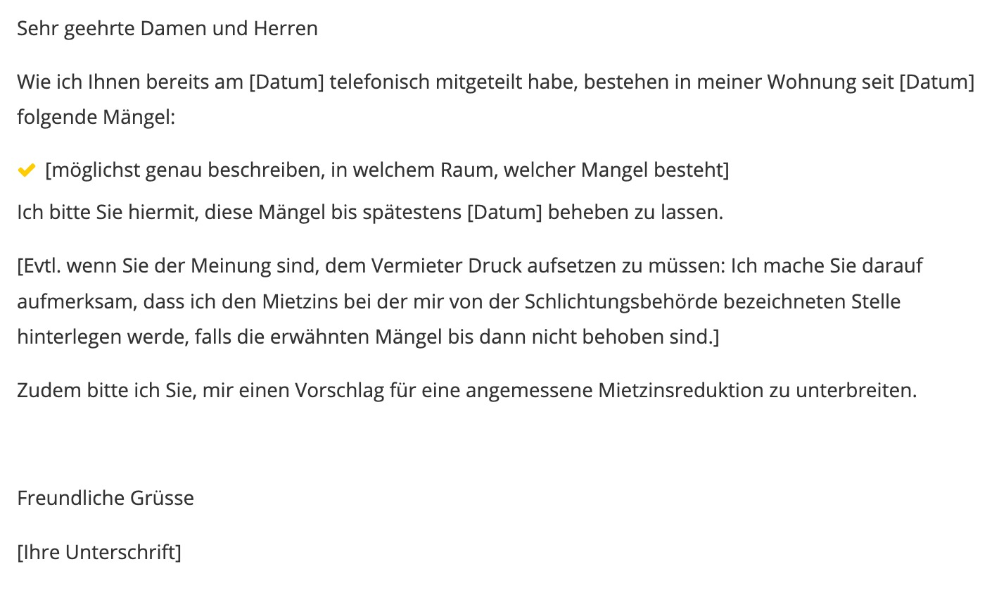

# Wohnen

Hier gebe ich dir alle nützlichen Tricks rund ums Thema Wohnen

## Wohnungs-Suche | Der Weg zur neuen Wohnung

Wenn du ins Leben startest <u>oder</u> mit deiner aktuellen Wohnsituation nicht mehr zufrieden bist, dann musst du den folgenden Guide zur Wohnungssuche durchmachen.

Zunächst musst du **Wohnungen besichtigen**. Hier kannst du die typischen **Wohnungsplattformen** auf dem Internet durchforsten

- <u>Gute Website, die Wohnungen herausgeben</u>: 
  - **Flatfox**: https://flatfox.ch/de/
  - **HomeGate**: https://www.homegate.ch/

### Schritt 1: Besichtigung von Wohnungen | Datensammlung im Wohnungsmarkt

> Email to get in touch: 

```
Sehr geehrte Frau / sehr geehrter Herr,

Gerne würden wir - ich, Viviane Walker, und mein Freund, Joffrey Mayer - uns für einen Besichtigungstermin für Ihre ausgeschriebene Wohnung bewerben. 

Damit weniger Hürden zwischen den Parteien besteht, haben wir uns die Mühe gemacht, uns auf unserer Webseite ein bisschen genauer vorzustellen: https://www.unsere-wohnung.ch

Wir hoffen sehr, dass unser kleiner Online-Auftritt von uns, Sie mindestens so begeistert, wie wir es von Ihrer Wohnung sind!

Wir würden uns sehr auf eine positive Antwort Ihrerseits freuen.

Freundliche Grüsse,

Vivane & Joffrey
```

#### Fragen für Wohnungsbesichtigung

- [ ] <u>Self-Check</u>: Hat man in jeder Wohnungsecke Handy-Empfang?
- [ ] <u>Bezüglich Waschküche</u>: Gibt es einen Wochenplan oder "first come first serve"?
- [ ] Gibt es einen Keller oder einen Estrich?
- [ ] Wie sind die Nachbarn?
- [ ] Welchen Preis verlangen Sie, um die Möbel zu übernehmen? // Wie viel kosten die zu übernehmenden Möbel?
- [ ] Gibt es eine Kaution? Wenn ja, wie hoch ist die Kaution?
- [ ] Wie viel zahlt der Vormieter?

### Schritt 2: Bewerbungsunterlagen einreichen

Falls dir eine Wohnung gefallen hat, dann musst du dich bei der Verwaltung bewerben. 

- <u>Tipp</u>: **Schnelligkeit bei der Wohnungsbewerbung ist ein Schlüsselfaktor**. 

Die Stadt Zürich besitzt aktuell (2025) quasi keine leeren Wohnung (< 0.1%). Entpsrechend ist es wichtig, _sofort nach_ der Wohnungsbesichtigung eine Bewerbung abzusenden (geht ca. 20-30min, wenn du alle Unterlagen hast).

#### Was für Bewerbungs-Unterlagen braucht es insgesamt für eine Wohnung? | Notwendige Vorarbeit

Hier eine Liste mit allen Dokumenten, die du offiziell für eine Wohnungs-Bewerbung benötigst:

- [ ] Ein traditionelles Bewerbungsschreiben
- [ ] Ein Link zu [deiner Webseite](https://github.com/joffreymayer/unsere-wohnung)
- [ ] Betreibungsregister-Auszug <u>aller</u> Bewerbenden ([online bestellbar](https://www.stadt-zuerich.ch/de/lebenslagen/einwohner-services/betreibungen/betreibungsregisterauszug-bestellen.html))
- [ ] Lohnausweis
- [ ] Eventuell Sparkonto-Angabe
- [ ] Scan deiner ID

***Anschliessend heisst es abwarten. Wenn du einen Anruf bekommst, dann werden Sie dir die "good News" übermitteln. Wenn du eine Absage bekommst (vermutlich per Email), dann kannst du wieder von vorne beginnen. xD***

#### Chancen-Maximierung bei Bewerbungsprozess?

Wie immer im kapitalistischen System: **der entscheidende Faktor ist immer _Geld_**, ob du es willst oder nicht.

- **Geheimtrick**: erstelle eine **[simple statische Webseite](https://github.com/joffreymayer/unsere-wohnung)** über dich und stelle dich dort vor. 

*Eine eigene Bewerbungs-Webseite - in Kombination mit den "traditionellen" Bewerbungsunterlagen - wird dir helfen, jeweils quasi immer in die Endrunde zu gelangen* 🔥

#### Erhöhung deiner Chancen, wenn du zur Zeit arbeitslos bist?

Wenn du...:

- Sehr wenig Ersparnisse, <u>und</u>
- Keinen Job hast,

... dann gibt es die Möglichkeit, einen **Solidarhafter** anzugeben. Wenn dieser genug Garantien bringt, dann hast du vielleicht Glück und wirst auserwählt für eine Wohnung ;)

### Schritt 3: Unterzeichnung des Mietvertrags

Wenn du ausgewählt wurdest: gratuliere! Als Nächstes wirst du den **Mietvertrag unterzeichnen** müssen.

#### Was muss beachtet werden bei einem Mietvertrag?

- [ ] <u>Kündigungsfristen</u>: Man konnte bei unserer ersten Wohnung am Sonntagsteig 4 (8006, Zürich) nur jeweils im April oder im Oktober kündigen, wobei **3 Monate im Voraus** - also bis Ende Dezember oder Ende Juni - ein **_Einschreibebrief_ mit "amtlichen Formular ([hier eine Vorlage vom Rechtsdienst vom Coop](https://www.vertragshilfe.ch/kuendigungsvorlagen/mietvertrag-kuendigen/)) an die Verwaltung schickt. Ausserdem darf man - bei uns jedenfalls - frühestens nach 1 Jahr "leben in der Wohnung" künden. 
  - <u>Wichtig</u>: Wenn man trotzdem früher kündigen will, musst du - als Mieter - die Leute ausfindig machen und NICHT die Verwaltung (was für ein Witz! xD).
- [ ] <u>Kautionen</u>: Diese sind in der Regel 2 bis 3 Monatsmieten, als Sicherheit. Diese musst du - zusätzlich zur ersten Miete - zahlen. Das ist ein **Investment** von circa CHF 6'000, also nicht zu unterschätzen!
  - <u>Wichtig</u>: Die Verwaltung kontaktiert eine Bank, welche ein "Kautionskonto" eröffnet. Du musst den Betrag auf dieses Konto überweisen. Wenn nichts passiert, kannst du dein Geld retour kriegen, nach Ende des Mietvertrags (wie genau, weiss ich noch nicht... <mark>Update folgt</mark>). 
  - <u>Wichtig 2</u>: WENN bis zum Mietantritt das "Bankkonto"Kautionskonto" noch _nicht_ eröffnet wurde, dann musst die Kaution an das (private) Konto der Verwaltung schicken (per Einzahlungsschein). Die Verwaltung ist verpflichtet, die Summe weiterzuleiten an ein Mieterkautions-Konto einer Bank ihrer Wahl. 
- [ ] <u>Nebenkosten</u>: Darunter fallen zum Beispiel Strom, Wasserverbrauch, Kaminfeger etc. Diese _musst_ du bezahlen, zusätzlich zur fixen Miete, JEDEN Monat. Bei uns wäre dies **CHF 155**. 
  - <u>Wichtig</u>: Diese sind **variabel**!! Dh sie können höher / tiefer anfallen. Besonders aufpassen musst du hier - wenn es sehr unsichere wirtschaftliche Zeiten sind - wie jetzt gerade mit dem Ukraine-Krieg, welche die Kosten der Energie & Benzinpreise stark zum steigen bringt...
- [ ] <u>Adressenänderung (nach Umzug in neue Wohnung)</u>: **Innert 8 Tagen**, musst du die neue Gemeinde kontaktieren - bei der **Einwohnerkontrolle** - damit der Staat weiss, dass du umgezogen bist (wegen den Steuern). 
- [ ] <u>Mietzinserhöhungen</u>: Der _Vermieter_ darf nur dann eine (periodische) Mietzinserhöhung vollziehen, wenn du _mindestens_ einen 3 Jahresvertrag unterzeichnet hast. Der Mietzins darf dabei nur jährlich erhöht werden (= "periodische Mietzinserhöhung"). 
  - <u>Wichtig</u>: Du darfst als Mieter reklamieren, wenn du empfindest, dass der (ersten) Anfangsmietzins viel zu teuer ist (= "wenn der Vermieter den Anfangsmietzins gegenüber dem früheren Mietzins erheblich erhöht hat"). Du musst dann **innert 30 Tagen nach Übernahme der Wohnung die _Schlichtungsbehörde_ (<mark>Wo finde ich die??</mark>) kontaktieren**.
  - <u>Quelle</u>: Schweizer Obligationsrecht.
  
### Schritt 4: Einrichtung des Mieter-Kautionskontos

Nach der Unterschrift des Miet-Vertrags, geht es im nächsten Schritt darum, das Mietkautions-Konto zu eröffnen.

- Anleitung aller groben Schritt ist [hier (lokal)](/Users/jomaye/Documents/Life/04 Wohnung/02-leben-in-wohnung/00-wichtigste-dokumente/kaution/2025).

#### Bei welchen Banken können Mieterkautionskonten eröffnet werden?

Grundsätzlich bieten alle grössere Schweizer Banken diese Dienstleistung an und es steht dir frei, zu wählen, welche Bank du möchtest.

- **<u>Tipp</u>**: Empfehlenswert ist es, **bei der UBS ein Mietkautionskonto** zu eröffnen, denn aktuell (in 2025) ist es so, dass man keine Unterschrift von der Verwaltung / Vermieter-Partei und somit **geht deutlich schneller, als bei der ZKB (das ging quasi 2 Monate bei der ZKB VS. 1-2 Wochen bei der UBS...)**. 

#### Email Mietkautionskonto _nach_ Schlüsselübergabe (Ausnahme)

Wenn das Mietkautionskonto erst _nach_ Schlüsselübergabe von der Bank eröffnet wurde, dann musst du dies der Verwaltung melden.

> Mein Update-Email für Verwaltung: 

```
Sehr geehrte Frau Schiesser, sehr geehrter Herr Ruckstuhl,

Wir wollten Ihnen kurz die Information weiterleiten, dass wir heute per Post von der ZKB die Eröffnung des Mietkautionskonto (inkl. Gebühr von CHF 50) bestätigt bekommen haben. Sie finden den Brief im Anhang für den download, falls Sie dies benötigen. 

Die Kontonummer des Mietkautionskonto lautet: 3500-5.215316.6
Die IBAN lautet des Mietkautionskonto lautet: CH09 0070 0350 0521 5316 6

Die Kaution haben wir - weil das Mietkautionskonto noch nicht vorlag - auf das Konto der Vermieter, Herr Robert Lebet & Frau Thomen-Lepek Mirja, überwiesen, inklusive der CHF 50 für die Eröffnung des Kautionskontos (siehe Quittung im Email). 

Bezüglich des Weiteren Vorgehens: Wir nehmen an, dass Sie nun die obigen Informationen des Kontos an die Vermieter weiterleiten, damit diese den von uns überwiesenen Betrag von CHF 5'350 auf das Kautionskonto übertragen, ist dies korrekt?

Falls Sie weitere Informationen benötigen, können Sie uns gerne eine Email schreiben oder uns per Telefon anrufen. 

Danke für Ihre Mühen & das Aufklären!

Freundliche Grüsse,

Joffrey Mayer & Viviane Walker
```

### Schritt 5: Schlüsselübergabe

Wenn die Bank deine Überweisung des Kautions-Betrages bestätigt hat, ist es erlaubt, dass die Schlüsselübergabe stattfindet (zwischen Vor- & Nachmieter, sowie der Verwaltung als Intermediär). 

Bei der Schlüsselübergabe geht es darum, dass du mit dem Vormieter und der Verwaltung anschaust, **ob keine Schäden in der _leeren_ Wohnung** vorhanden sind, die du nicht verursacht hast. Es ist wichtig, dass du hier genau hinschaust, ansonsten wirst du beim Verlassen der Wohnung evenutell für Schäden verantwortlich gemacht, die du gar nicht begangen hast!

Zu beachten sind insbesondere:

- [ ] Wie sieht es mit dem Küchenfilter aus? Wurde er gereinigt / ersetzt?
- [ ] Ist die Mikrowelle in gutem Zustand? Wurde sie gereinigt?
- [ ] Wie sieht es mit dem Geschirrspüler aus?
- [ ] Wie sieht der Hahn & Duschkopf im Badezimmer aus?
- [ ] Wurden die Rollläden gereinigt?
- [ ] Sind die Wände sauber / haben keine Löcher / wurden nicht mit Farbe bekleckert?

Am Ende dieses Termins erhälst du dann die Schlüssel der neuen Wohnung und du kannst nun deine Möbel in die neue

#### Wichtigstes Aufpassfeld bei Schlüsselübergabe & Kündigungen von *alter* Wohnung?

Nur wenn du die Schlüssel der **neuen** Wohnung hast, darfst du auch alle deine Sachen aus der *alten* Wohnung einbringen. 

*Entsprechend musst du den **Kündigungstag (der alten Wohnung)** um - beispielsweise - 1 Tag <u>nach</u> dem Einzugstag festsetzen.* 

Dieses Detail ist entscheidend, denn zwar zahlst du hier vielleicht für mehrere Tage doppelte Miete, aber dafür hast du kein Risiko, für 1 Tag ein Lager zu organisieren, weil du noch warten musst, dass du einen neuen Schlüssel erhälst für die neue Wohnung.

### Schritt 6: Der Umzugstag

Hier organisierst du am besten im Voraus eine Umzug-Firma, welche

- **Tipp**: Kaufe dir viele Umzugskartons (oder miete sie von der Umzugsfirma), sowie Seidenpapier für dein Geschirr. Solche Werkzeuge wirst du **als Vorarbeit** brauchen, damit du am Umzugstag selbst keine Zeit verlierst.

***Nach* dem Umzugstag solltest du dich auf das Aufbauen deines Betts konzentrieren. Aber damit ist der Übergang in die neue Wohnung erfolgt, gratuliere!**

## Leben in aktueller Wohnung | Dein Generalquartier

Die **Wahl deines Wohnort**, sowie **die Innenaustattung** und **Organisation deines Haushaltes** wird letzlich entscheiden, wie "erfolgreich" du und dein:e Partner:in im Alltag haben wirst. 

*Deshalb ist es von grosser Wichtigkeit, dass du dich - progressiv, über die ersten Monate hinweg - gut einlebst in die neue Wohnung.

### Admin zum Leben in Wohnung | "PROD"-Modus

Dokumente solltest du [hier (lokal)](/Users/jomaye/Documents/Life/04 Wohnung/02-leben-in-wohnung/00-wichtigste-dokumente) ablegen.

### Kennenlernen der Wohnung | Phase 1

Hier eine Übersicht der To-Do's:

- [ ] Fotos leerer Wohnung machen (für rasches "Deployment" auf WOhnungsplatformen bei zukünftigem Umzug) und [hier](/Users/jomaye/Documents/Life/04 Wohnung/02-leben-in-wohnung/00-wichtigste-dokumente/fotos-aktuelle-wohnung) ablegen
- [ ] Dauerauftrag für neue Miete aufsetzen.
- [ ] Neue Namensschilder bestellen ([Anleitung hier](/Users/jomaye/Documents/Life/04 Wohnung/02-leben-in-wohnung/00-wichtigste-dokumente/namens-schilder)).
- [ ] Rückerstattung der Mietkaution der vorherigen Wohnung.
- [ ] Anmeldung in neuer Gemeinde.
- [ ] Haftplfichtversicherung abschliessen.
- [ ] Mängel dokumentieren beim Wohnen ([Anleitung hier](/Users/jomaye/Documents/Life/04 Wohnung/02-leben-in-wohnung/00-wichtigste-dokumente/maengel-bericht)).
- [ ] Möglicherweise Mietzins anfechten (falls Referenzzins-Senkungen, [siehe Anleitung hier](/Users/jomaye/Documents/Life/04 Wohnung/02-leben-in-wohnung/00-wichtigste-dokumente/mietzins-reduktion/2025))

#### Email: Reklamation bei Mängel

*Nach* der Schlüsselübergabe, hatten wir bei unserer ersten Wohnung (gemäss Vertrag), **3 Tage Zeit**, um Mängel anzugeben. 

Hier ein Beispiels-Brief, wenn du in der Wohnung Sachen zu bemängeln hast (zu wenig gut geputzt oder Dinge sind kaputt, die du nicht zu verantworten hast etc...):



> Meine Version, weil wir im Nachhinein noch Mängel fanden:

```
Sehr geehrter Herr Ruckstuhl,

In unserem Vertrag steht, dass wir eine Frist von bis zu 3 Tage haben, um potentielle Mängel zu melden. Meine Partnerin hat heute ebenfalls noch rasch einen Blick auf die Wohnung geworfen. Dabei ist ihr noch der Filter des Geschirrspülers aufgefallen, sowie ein kaputter Dämpfer bei der Toilette und dessen Dichtung. In der Küche gab es noch - hinten beim Dampfabzug - ein bisschen Silikon, welches herunterhing (siehe Fotos im Anhang). 

- <u>Bezüglich Filter, was meinen Sie</u>: *lässt sich dieser mit einer feinen Bürste komplett reinigen oder sollte auf einen neuen zurückgegriffen werden*? Ich tendiere dazu, dass hier eine Reinigung ausreicht, aber vielleicht sieht das Ihr geschultes Auge anders =)

Dann noch eine Frage bezüglich des Parkettbodens, welcher an die Küche angrenzt:

- *Sollen wir bei der Leiste unterhalb des Geschirrspülers ein Klebeband antun (siehe Foto im Anhang)*?

Für alle die obigen angegebenen Mängel sind wir der Meinung, dass wir keinen Ersatz brauchen. Wir wollen mit den Bildern im Anhang einfach, dass beide Parteien diese von uns bemerkten Abnutzungen so vermerkt haben. Deshalb wären wir froh, wenn Sie das Abnahmeprotokoll mit den in diesem Email angegebenen Sachen ergänzen könnten.

Besten Dank für das Aufklären und für Ihre Mühen!

Freundliche Grüsse,

Joffrey Mayer & Viviane Walker
```

#### Adressenänderung: Anmeldung neue Gemeinde

Nachdem du in die Wohnung eingezogen bist, musst du dich bei der _Einwohnerkontrolle_ melden, damit diese dich auch bei der neuen Gemeinde registrieren. 

Die Adressenänderung hat jedoch als Konsequenz, dass du dich bei diversen Unternehmen für eine korrekte Admistration melden musst, um ihnen Bescheid zu geben, dass du umgezogen bist. 

Folgende Unternehmen musst du kontaktieren, um deine neue Adresse zu registrieren: 

- [ ] Ursprüngliche Gemeinde, in der du _vor_ dem Umzug gewohnt hast.
- [ ] Alle Banken, bei denen du ein Konto hast.
- [ ] Deine Universität (wenn du als Student angemeldet bist)
- [ ] Arbeitgeber
- [ ] Post (für Briefumleitungen. Kann in einer Filiale gemacht werden)
- [ ] TV & Handyanbieter
- [ ] ZVV- & ÖV-Bilett
- [ ] Versicherung (Krankenkasse, Privathaftpflich & Hausrat)
- [ ] Freunde & Familienangehörige
- [ ] Zeitschriften & Abonemente
- [ ] Hausarzt / Zahnarzt / Frauenarzt

### Einrichten der Wohnung | Phase 2

Hier eine Übersicht der To-Do's:

- [ ] Grundriss der leeren Wohnung abmessen, um die richtigen Möbel zu finden (falls du noch zu wenig / nicht richtige Ausstattung hast)
- [ ] Anschliessend kannst du das folgende Vorgehen [in diesem Issue](https://github.com/joffreymayer/haushalt/issues/38) übernehmen.

***Wichtig zu verstehen ist, dass - falls du noch gar keine Möbel hast (oder nur sehr wenige) - der Prozess hier sehr lange sein kann und sich <u>über mehrere Monate (gar Jahre)</u> ausstrecken kann.***

## Laufender Betrieb der Wohnung 

Egal in welcher Phase du dich im Leben befindest, benötigt eine Wohnung **regelmässige Pflege**. 

### Was gehört zur Pflege einer Wohnung? | Übersicht der Massnahmen

Ziel dieses Kapitel ist es, dir die **wichtigsten Gewohnheiten zur Pflege einer Wohnung** zu erklären, insbesondere:

- Regelmässiges Lüften (täglich).
- Regelmässiges Putzen der ganzen Wohnung (2x pro Monat).
- Regelmässiges Pflegen der Küchen- & Waschgeräte im Bad und Waschküche (jedes halbe Jahr).
   - <u>Tutorial für Reinigung der Waschmaschine</u>: https://youtube.com/shorts/aDmhSbFrF6I?si=YIW-tqR5Yr3VdHM6

### Warum ist die sorgfältige Pflege der Wohnung wichtig? | Relevanz 

Folgende Konsequenzen sind Beispiele, welche Risiken bestehen, wenn du deine Wohnung nicht regelmässig pflegst:

- **Monetäre Konsequenzen**: Teure Küchengeräte (z.B. Waschmaschine oder Ofen) oder Möbel müssen schneller ersetzt werden und du musst grössere Summen auf den Tisch legen, um die Geräte zu ersetzen.
- **Gesundheitliche Konsequenzen**: Wenn die wegen mangelndem Putzen schnell abgenutzt wird oder wegen mangelndem Lüften Schimmelbildungen bei den Fenstern bildet, dann kann das zu (langfristig) schwerwiegende gesundheitliche Konsequenzen führen. 


### Regelmässiges Lüften (2-3x pro Tag) | Massnahme 1

#### Warum muss man regelmässig lüften? | Das Problem

Deine Fenster "schwitzen" und es bildet sich - bei grösseren Temperaturunterschieden zwischen drinnen & draussen (insb. **im Winter oder früher Morgens in kälteren Sommernächten**), in Kombination mit höherer Luftfeuchtigkeit drinnen (hängt von der Isolation der Wohnung & Lüftungsverhalten ab) - deshalb **Kondenswasser** an den Ränden der Fensterscheiben. Das Wasser fliesst auf das Silikon der Scheiben runter und es kann sich dadurch **Schimmel** bilden.

- <u>Das Problem ist hier detaillierter beschrieben (ab 0:20-1:10)</u>: https://www.youtube.com/watch?v=JxZp4ScObHQ&t=20s


#### Stosslüften | Die Lösung

Um den neggativen "Schimmel"-Effekt der Kondensation an deinen Fenster vorzubeugen, ist (stark) empfohlen **täglich 2-3x Stosslüften** zu betreiben:

- Du öffnest alle deine Fenster komplett und lüftest 5-10min.
  - <u>**Tipp**</u>: Mach das **während des Kochens** (am Mittag & Abend) oder nach dem Duschen, weil dadurch **enorm viel Wasserdampf (und somit Luftfeuchtigkeit)** entsteht und durch das Lüften die ganze mit Wasserdampf gefüllte Luft evakuiert wird.
  
### Regelmässiges Putzen der ganzen Wohnung (2x pro Monat) | Massnahme 2

Hierbei geht es darum, dass du deine Wohnung regelmässig putzt, damit du **höhere Lebensqualität & Lebensfreude hast im Alltag**.

Hier die Liste, das zum Putzen dazu gehört:

- **Boden**:
  - Mit dem **Wisch-Mopp** den ***gesammten* Boden der Wohnung** aufwischen und Staub, Dreck & Haare in Häufchen versammeln.
  - Anschliessend mit **Staubsauger** die Staubhügel aufsaugen.
- **Bad**:
  - Badewanne & Lavabo mit **Cif & Schwamm** säubern.
  - **Boden mit feuchtem Tuch** waschen.
  - Spiegel mit **Fenster-Spray** reinigen.
  - Alle **Abstelloberflächen entstauben**.
- **Möbel & TV**:
  - Mit **Swiffer abstauben**.

### Regelmässiges Pflegen der Küchen- & Waschgeräte im Bad und Waschküche (2x pro Jahr) | Massnahme 3

Hierbei geht es darum, dass du - mit Putzen - die **Abschreibung aller deiner Haushaltsgeräte vorbeugst**.

Hier die Liste, das zur Pflage der Haushaltsgeräte dazu gehört:

- **Küche**:
  - **Mikrowelle mit feuchtem Tuch** von Essensreste säubern
  - **Teekanne entkalken** und säubern.
  - **Ofen** & Platten gründlich säubern.
  - **Luftabzug**: Oberfläche & Filter reinigen
  - **Abfluss**: Entstopfen mit mechanischer Bürste.
- **Wohnzimmer**:
  - Leder-Sofa pflegen (siehe [Anleitung IKEA](https://www.ikea.com/ch/de/p/stockholm-3er-sofa-seglora-naturfarben-80245051/)):
    - Mit einem Staubwedel reinigen oder vorsichtig mit einer weichen Bürste staubsaugen.
    - Mit einem feuchten Tuch abwischen.
    - Vor direkter Sonneneinstrahlung schützen, um Austrocknen vorzubeugen.
  - Teppich pflegen (siehe QR-Code auf Teppich).
- **Bad**:
  - **Abfluss**: Haare und sonstige Überreste aus Abfluss entfernen.
  - **WC**: entkalken, falls nötig.
    - <u>Falls **verstopft**, befolge diese (Youtube-Short) Anleitung hier</u>: https://youtube.com/shorts/G7B0Ytq7iwk?is=rv7L3irQ7N9ezPXI
- **Waschküche**:
  - Wasch-Zelle entstauben.
  - Waschmaschine:
    - Führen Sie alle paar Wochen einen heißen Waschgang (60-90°C) mit einem speziellen Reiniger, Zitronensäure oder Geschirrspültab durch, um Bakterien, Schimmel und Kalk zu bekämpfen und Gerüche zu vermeiden.
    - Tumbler (siehe [Migros-Anleitung](https://www.migros.ch/de/content/migmag-tumbler-reinigen)):
      - **Nach jeder Nutzung putzen**:
        - **Flusensieb**: Darin sammeln sich nach jeder Nutzung Fusseln und Staub.
        - **Behälter fürs Flusensieb**: Vergiss nicht, die Halterung, in der das Flusensieb steckt, **regelmässig mit einem feuchten Lappen** abzuwischen. 
        - **Trommel und Tür**: Innerhalb der Trommel und an der Tür des Tumblers sammeln sich ebenfalls Fusseln. Darum solltest du die Trommel jedes Mal kurz **mit einem feuchten Lappen** abwischen.
      - **Regelmässig reinigen**:
        - **Wasserbehälter**: Ist dein Tumbler nicht ans Abwasser angeschlossen, musst du das Restwasser nach einigen Nutzungen leeren. Dafür musst du den Wasserbehälter entfernen. Dieser befindet sich meist oben rechts. Mit der Zeit können sich dort auch **üble Gerüche** bilden. Um den Behälter zu reinigen, füllst du heisses, nicht kochendes Wasser in den Behälter. Mische etwas Essig oder Zitronensäure bei. Schüttle den Wasserbehälter anschliessend und lass das Gemisch bis zu einer Stunde einwirken. Spüle den Behälter dann mehrmals gut aus.


