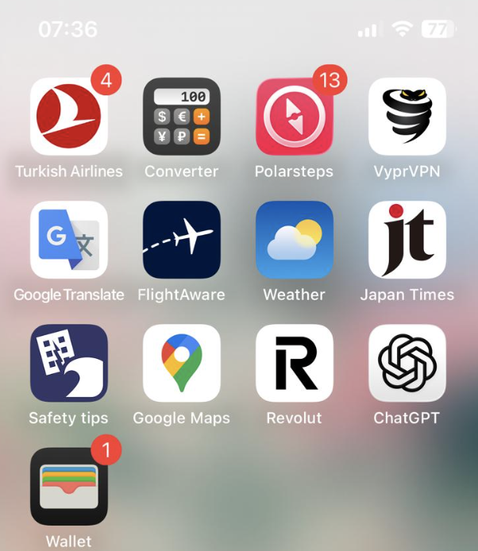

# Ferien

In diesem Kapitel geht es um das Thema Ferien.

## Ferien in Ausland (Japanreise 2025)

Du machst eine Reise ins Ausland? Hier erhälst du alle Tipps & Tricks, um dich optimal vorzubereiten.

### Vorbereitung

- [ ] **Pass-Gültigekeit** kontrollieren (sollte bis mind. **Ausreisedatum** gültig sein, aber eventuell muss das Ablaufdatum auch weiter in der Zukunft liegen, je nach Land...)
- [ ] **Sonstige Einreisebedingungen** des Lander, in dem du Ferien machst, beachten:
  - Import von Ware aus dem Ausland in die Schweiz (z.B. max. 150 CHF pro Person darf Zollfrei importiert werden aus Japan).
  - Um nach Japan einzureisen, mussten wir z.B. ein Einreiseformular online ausfüllen (und erhielten einen QR-Code, den wir am Zoll aufweisen mussten).
- [ ] **Internet im Ausland** einrichten (Empfehlung: E-SIM).
- [ ] **Bargeld** via Banking-App nach Hause bestellen (viele Läden akzeptieren weiterhin nur "Cash").
- [ ] **Virtuelles Geld auf _Revolut-Konto_ überweisen**, um bargeldlos zu zahlen.
- [ ] **Reiseversicherung** abschliessen:
  - [Rega](https://www.rega.ch/rega-goenner/goenner-werden/ihre-vorteile-als-goennerin-oder-goenner)
  - [Europe Assistance](https://online-services.europ-assistance.ch/de/lp-reiseversicherung) (für _eine_ Reise <u>und</u> für _mehrere_ Personen).
  - [Reiseversicherung Mobiliar](https://www.mobiliar.ch/privatpersonen/fahrzeuge-und-reisen/reiseversicherung) für ein **ganzes Jahr**.
  - [SOS144](https://www.sos144.ch/de), das die Rega inkludiert.
- [ ] **Für Handy & co.: Ladegerät-Typ** prüfen (für genügend Akku).
- [ ] **Flug: Check-In 24h** vor Abflug (via App der Fluggesellschaft möglich).
- [ ] **Nützliche Reise-Apps herunterladen**, welche beim Reisen nützlich sind, hier einige Beispiele (Stand: 2025):

## Skiferien: Checkliste

Ich empfehle dir, folgende Dinge mitzunehmen & abzuklären:

### Kleider & Ausrüstung

- [ ] Skischuhe
- [ ] Ski
  - [ ] Skischuhe (inkl. Ski) ins Décathlon bringen, damit er sie dir auf die Ski anpasst (Kosten: CHF 30)
- [ ] Skihose
- [ ] Skihelm
- [ ] Skibrille
- [ ] Skijacke
- [ ] Calleçon
- [ ] Ski-Socken
- [ ] Cagoule
- [ ] Handschuhe
- [ ] Winterpullis (2-3 pro Woche)
- [ ] T-Shirts
- [ ] "normale" Hosen
- [ ] "normale" Socken
- [ ] Unterhosen
- [ ] Kappe
- [ ] Winterstiefel

### Necessaire 

- [ ] Sonnenbrille
- [ ] Sonnencrème
- [ ] Lippenbalsam / Labello
- [ ] Necessaire (Zahnpasta, Zahnbürste, Shampoo, Anti-Allergikum und Rasierer)
- [ ] Ohrenstäbchen

## Ferien: Procelette chez les Mamies

- [ ] ID
- [ ] T-Shirts
- [ ] Hosen
- [ ] Zahnpasta
- [ ] Zahnbürste
- [ ] Ladekabel
- [ ] Euros 
- [ ] 10.90 Euros (für 1 Fahrt wegen Péage) --> falls du über Obernai / Saverne gehst (via Landstrassen), dann ist es nur 5.8
- [ ] Tanken (Hin- & Rückfahrt)
