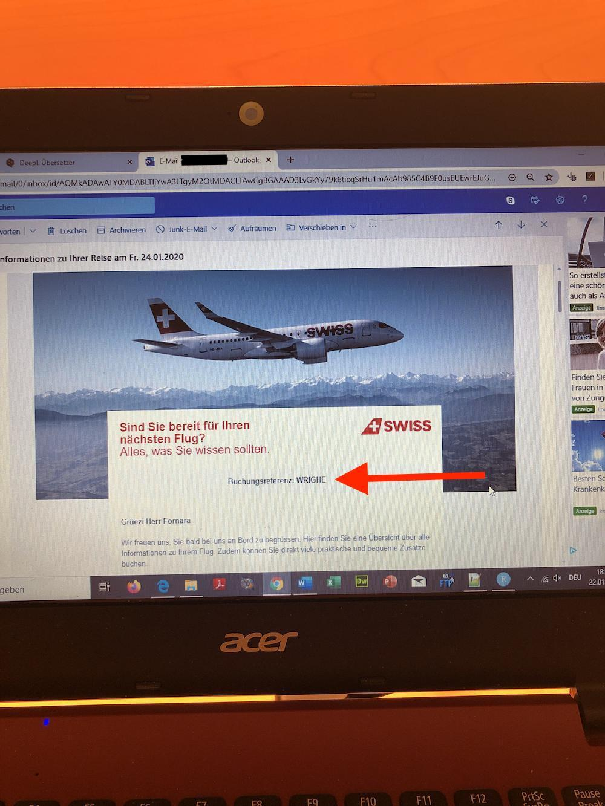
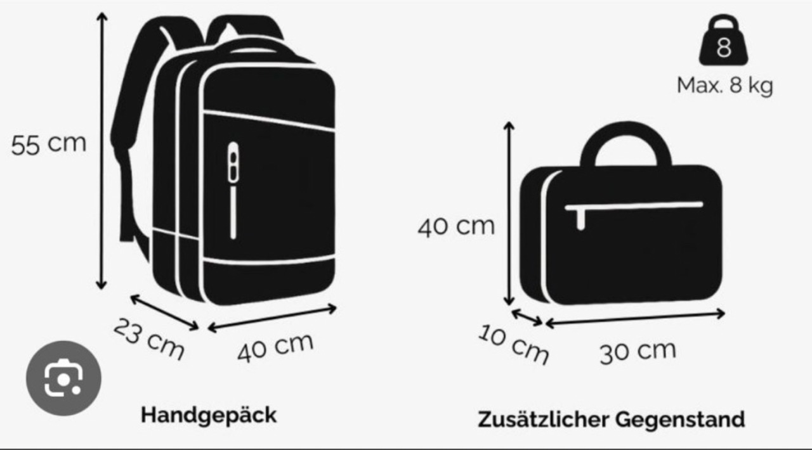
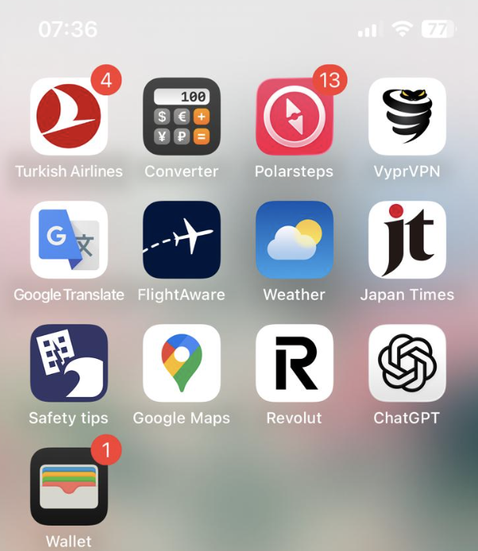

# Ferien

In diesem Kapitel geht es um das Thema Ferien, insbesondere **zwei Phasen**:

- Ferienplanung & -buchung,
- Vobereitung gebuchter Ferien,

## Ferienplanung & -buchung | Phase 1

In dieser ersten Phase geht es darum, dass du 

### Ziele

Hier die Kernfragen, die du beim Abschluss dieser Phase beantworten solltest:

- [ ] **Organisatorische Rahmenbedingungen der Reise**:
  - [ ] **In- oder Ausland**: in welches Land soll es gehen? 
  - [ ] **Personen**: Mit wem reist du in die Ferien (inkl. Anzahl Personen)?
  - [ ] **Datum**: wann soll die Reise stattfinden (Abfahrts-Tag beim Start der Reise & Ankunfts-Tag bei der Rückreise)?
  - [ ] **Internet**: brauchst du ein WLAN-Paket von deinem Telefon-Anbieter, um Internet im Ausland zu haben?
    - [ ] <u>**Wenn "ja"**</u>: Welches Angebot eignet sich am besten? 
  - [ ] **Geld**: welches Budget hast du für Reisen in diesem Jahr insgesamt und - falls du bereits Ferien genommen hast - wie viel Budget bleibt dir noch und welchen Anteile gehen an Flug / Hotels / Restaurants / Internet / sonstige Aktivitäten (Sehenswürdigkeiten, Parks, Ausflüge etc...)?
  - [ ] **Zwischen-Etappen**: planst du, deine Ferien nur an einem Ort zu verbringen oder an Mehreren?
  - [ ] **Bargeld & Revolut**: wie viel Geld willst du "Bar" mitnehmen und wie viel auf deine Revolut-Karte?
    - <u>Bemerkung</u>: *Hängt auch davon ab, ob in einem Land bargeldloses Zahlen "normal" ist oder nicht.*
- [ ] **Auto**:
  - [ ] **Geld & vergangene Erfahrung**: gibt es Kalender-Tage, an denen die Auto-Anreise besonders / teuer ist (z.B. zeitlich keine Staus bzw. "low-season" weil keine Ferien)?
  - [ ] **Abfahrtszeit festlegen**: Fahre - wenn möglich - *immer* in der Nacht ab (ca. 19:00), denn die Strassen sind viel zu voll (wir haben im Mai 2026 während des Pfingswochenende 4h statt 2.5h gebraucht von der Schweizer Grenze bis zum Hotel in Lazise am Gardasee). Pass auf, dass das Hotel 24h Betrieb hat für das Checkin.
  - [ ] **Falls du in den Süden fährst**:
    - <u>Monitoring Gotthard (inkl. Sondersperrungen)</u>: https://www.tcs.ch/de/tools/verkehrsinfo-verkehrslage/gotthard-tunnel.php#anchor_Staukalender
      - <ins>**Learning aus Gotthard-Staus am Pfingst-Wochenende im Mai 2026**</ins>: wenn du in den Süden fahren willst in "Ferienhochsaison" (oder verlängerten Weekends wie z.B. Pfingsten) - dann ist **schon ab 05:00 Uhr Morgens 10km Stau** (und wächst dann auf 20km bis in den Nachmittag): https://www.srf.ch/news/schweiz/verkehr-am-pfingstwochenende-gotthard-stau-waechst-auf-rund-20-kilometer-an
  - [ ] **Entscheid**: welchen konkrete Auto-Route nimmst du (inkl. Rücksicht auf andere Personen)?
  - [ ] **Zwischen-Etappen einplanen bei längeren Reisen**: Gibt es Zwischen-Etappen, bei denen du eine Pause einlegen kannst und sehenswert sind?
  - [ ] **Tanken & Pneu-Prüfung am Vortag der Hinfahrt**: Mindestens den Tank vollständig auffüllen und den Reifendruck prüfen (ideal sind ca. 2.1 bis 2.3 Bar pro Pneu). 
    - <u>Aktuell unklar</u>: Ab wann lohnt sich eine Auto-Vermietung?
- [ ] **Flug**:
  - [ ] **Geld & vergangene Erfahrung**: gibt es Kalender-Tage, an denen der Flug besonders günstig / teuer ist?
  - [ ] **Entscheid**: welchen konkreten Flug nimmst du (inkl. Rücksicht auf andere Personen)?
  - [ ] **Flughafen-Ortschaft**: An welchem Flughafen fliegt das Flugzeug ab und an welchem Flughafen landet das Flugzeug.
  - [ ] **Vorlaufzeit für Hinfahrt**: wie viel Zeit willst du dir nehmen, um das Checkin & die Flughafenkontrolle zu überqueren? Suche dir die richtige öV-Verbindung aus bzw. organisiere ein Fahrzug (eigenes Auto oder Taxi).
    - <u>Aktuell unklar</u>: Ab wann lohnt sich eine Auto-Vermietung?
  - [ ] **Transport bei Ankunft**: wann landest du und welcher Transportmodus wählst du bei der Ankunft? Suche dir die richtige öV-Verbindung aus bzw. organisiere ein Fahrzug (eigenes Auto oder Taxi).
- [ ] **Hotels**:
  - [ ] **Lage & Ort**: In welcher Stadt & an welcher Adresse soll dein Hotel liegen?
    - <u>Bemerkungen</u>: 
      - *Bei **mehreren** Etappen, musst du auch mehrere Hotels wählen und die jeweiligen Transportfragen (Modus: öV / Taxi / Auto), sowie Abfahrts- & Ankunftszeiten planen.
      - Hotels immer **relativ zum City-Center** betrachten. Wenn du nur sehr kurze Zeit Ferien machst und dein Hotel weit Abseits vom City-Center liegt, ist es empfehlenswert, dein **Gepäck in einem Schrankfach** - beispielsweise an einem Bahnhof oder bei der Gemeinde - zu lassen, um keine Zeit (mehrere Stunden) zu verlieren und zum Hotel zu fahren, nur um das Gepäck abzulegen.
  - [ ] **Hotelklasse & vergangene Erfahrung**: welche Qualität soll das Hotel haben (z.B. Kosten pro Nacht, Bewertungen anderer Gäste, Anzahl Sterne, Pool / kein Pool, Gym / kein Gym, etc...) 
  - [ ] **Checkin 24/7 möglich?**: Diese Frage ist besonders relevant, wenn du die **Anreise mit dem Auto** planst 
  - [ ] Frühstück inklusive buchen: so hast du kein Stress am Morgen.
  - [ ] **Entscheid**: Welche(s) Hotel(s) wählst du?
  - [ ] **Checkout**: ab wann *spätestens* muss du aus dem Zimmer raus sein am Abfahrtstag?
- [ ] **Ferien-Aktivitäten**:
  - [ ] **Planungszeitpunkt**: sollen Ausflüge & Restaurants "spontan" vor Ort - via z.B. Tourismus-Guide (-> "Office du tourisme") - oder bereits vor Reisestart geplant werden? 
    - <u>Bemerkung</u>: Es ist auch ein **Mix aus beiden Strategien möglich**n.
  - [ ] **Ausflüge**: Wann willst du welche Sehenswürdigkeiten sehen und wie kommst du dorthin?
  - [ ] **Restaurants**: Wie viele und welche Restaurants willst du besuchen (kann auch spontan passieren)?
- [ ] **Notfälle**:
  - [ ] **Botschaft**: Notiere dir die genaue Adresse der Botschaft deines Landes (französischen). Das ist nützlich bei Notfällen (falls du deinen Reisepass verlierst / gestohlen wird, falls du einen medizinischen Notfall hast etc...).
  - [ ] **Reiseversicherung**: Notiere dir die genaue Telefonnummer deiner Reiseversicherung (falls du deinen Reisepass verlierst / gestohlen wird, falls du einen medizinischen Notfall hast etc...).

### Nützliche Tools zur Beantwortung der obigen Kernfragen?

- Allgemein:
  - [Schweizer Bund](https://www.eda.admin.ch/de/reisen-ins-ausland), wenn du **deine jährlichen Ferienplanung** erstellt, insbesondere, wenn es **Kriege / Konflikte auf der Welt** gibt.
  - [Google Maps](https://www.google.com/maps) für Fahrpläne, Adressen, Flüge, Hotels oder Restaurants.
  - [Instagram-App](https://www.instagram.com/) für trendige Ferien-Desitationen, Restaurants oder Hotels.
  - [Polarstep-App](https://www.polarsteps.com/de/) für das eigene Tracking deiner Reise (inkl. Fotos).
  - [Youtube](https://www.youtube.com) für die **Attraktionen-Planung**.
    - <u>Tipp</u>: ich empfehle dir Youtube-Videos mit Titeln, wie zum Beispiel "Top 10 <Deine_Feriendestination>". Dann kannst du dir diese in die Google Maps abspeichern. Für Zwischenstopps für Unterwegs, kannst du auch Chatbots brauchen: das hat mir ein gutes Restaurant in Ascona empfohlen.
- Frühstück im Hotel war super: so gabs kein Stress.   
- Flug:
  - [Ebookers.ch](https://www.ebookers.ch/en/Flights)
  - Internet-Seite & App der Fluggesellschaft, mit der du fliegen wirst (für Checkin wichtig).
- Hotels:
  - [Booking.com](https://www.booking.com/index.de.html)
- Restaurants:
  - [Tripadvisor-App](https://www.tripadvisor.com/) für gut bewertete Restaurants.

### Buchung des Fluges?

Hier wird beschrieben, wie du den Flug buchst.

#### How to do the Check-In mit der Swiss-App? | Nach der Zahlung

Du solltest nach der Bezahlung eine Email erhalten, wo deine „Buchungsreferenz“ steht, beispielsweise so:

Diese Buchubgsreferenz musst du in der App unter „Reservierungs- / E-Ticketnummer“ eingeben und dann solltest du das Check-In erledigt haben! 😊

#### Gepäck-Restriktionen

**Falls du Handgepäck oder einen kleinen Rucksack** mit auf den Flug nimmst, achte auf die vorgebenen **Richtlinien hinsichtlich Grösse des Gepäcks**.

Hier die aktuell (2026) gültigen Richtlinien für Handgepäck:

### Buchung des Hotels?

Hier wird beschrieben, wie du buchst.

## Vorbereitung gebuchter Ferien | Phase 2

In dieser Phase wird angenommen, dass du deine Ferien (inkl. Fluag & Hotel) bereits gebucht hast und es nun zur konkreten **"Setup" der Reise** übergeht, damit du sorglos in den Urlaub gehen kannst.

### Ferien in Ausland (Japanreise 2025)

Du machst eine Reise ins Ausland? Hier erhälst du alle Tipps & Tricks, um dich optimal vorzubereiten.

#### Vorbereitung

- [ ] **Pass-Gültigekeit** kontrollieren (sollte bis mind. **Ausreisedatum** gültig sein, aber eventuell muss das Ablaufdatum auch weiter in der Zukunft liegen, je nach Land...)
- [ ] **Sonstige Einreisebedingungen** des Lander, in dem du Ferien machst, beachten:
  - Import von Ware aus dem Ausland in die Schweiz (z.B. max. 150 CHF pro Person darf Zollfrei importiert werden aus Japan).
  - Um nach Japan einzureisen, mussten wir z.B. ein Einreiseformular online ausfüllen (und erhielten einen QR-Code, den wir am Zoll aufweisen mussten).
- [ ] **Internet im Ausland** einrichten (Empfehlung: E-SIM).
- [ ] **Bargeld** via Banking-App nach Hause bestellen (viele Läden akzeptieren weiterhin nur "Cash").
- [ ] **Virtuelles Geld auf _Revolut-Konto_ überweisen**, um bargeldlos zu zahlen.
- [ ] **Reiseversicherung** abschliessen:
  - [Rega](https://www.rega.ch/rega-goenner/goenner-werden/ihre-vorteile-als-goennerin-oder-goenner)
  - [Europe Assistance](https://online-services.europ-assistance.ch/de/lp-reiseversicherung) (für _eine_ Reise <u>und</u> für _mehrere_ Personen).
  - [Reiseversicherung Mobiliar](https://www.mobiliar.ch/privatpersonen/fahrzeuge-und-reisen/reiseversicherung) für ein **ganzes Jahr**.
  - [SOS144](https://www.sos144.ch/de), das die Rega inkludiert.
- [ ] **Leere Wohnung: Home-Sitter**  für deine leere Wohnung suchen.
- [ ] **Für Handy & co.: Ladegerät-Typ** prüfen (für genügend Akku).
- [ ] **Parkplatz reservieren 1 Tag vor Abfahrt mit Auto**: Hier die App (der TCS wirkt da mit, ist also "legit"): https://parcandi.com/ch-de/facility/71/59c40ed4-0063-f75d-36e6-6cca6362922b
- [ ] **Flug: Check-In 24h** vor Abflug (via App der Fluggesellschaft möglich).
- [ ] **Nützliche Reise-Apps herunterladen**, welche beim Reisen nützlich sind, hier einige Beispiele (Stand: 2025):

### Skiferien: Checkliste

Ich empfehle dir, folgende Dinge mitzunehmen & abzuklären:

#### Kleider & Ausrüstung

- [ ] Skischuhe
- [ ] Ski
  - [ ] Skischuhe (inkl. Ski) ins Décathlon bringen, damit er sie dir auf die Ski anpasst (Kosten: CHF 30)
- [ ] Skihose
- [ ] Skihelm
- [ ] Skibrille
- [ ] Skijacke
- [ ] Calleçon
- [ ] Ski-Socken
- [ ] Cagoule
- [ ] Handschuhe
- [ ] Winterpullis (2-3 pro Woche)
- [ ] T-Shirts
- [ ] "normale" Hosen
- [ ] "normale" Socken
- [ ] Unterhosen
- [ ] Kappe
- [ ] Winterstiefel

#### Necessaire 

- [ ] Sonnenbrille
- [ ] Sonnencrème
- [ ] Lippenbalsam / Labello
- [ ] Necessaire (Zahnpasta, Zahnbürste, Shampoo, Anti-Allergikum und Rasierer)
- [ ] Ohrenstäbchen

### Sommerferien: Checkliste

- [ ] Sonnnencrème (50er),
- [ ] Sonnenbrille
- [ ] Nastüechli für Heuschnupfen
- [ ] 2x Badehosen
- [ ] 2x kurze Hosen
- [ ] T-Shirts
- [ ] "normale" Hosen
- [ ] "normale" Socken
- [ ] Unterhosen
- [ ] ID
- [ ] Euros 
- [ ] Tanken (Hin- & Rückfahrt)

### Ferien: Procelette chez les Mamies

- [ ] ID
- [ ] T-Shirts
- [ ] Hosen
- [ ] Zahnpasta
- [ ] Zahnbürste
- [ ] Ladekabel
- [ ] Euros 
- [ ] 10.90 Euros (für 1 Fahrt wegen Péage, also Total **ca. 25€ auf Revolut übertragen**) --> falls du über Obernai / Saverne gehst (via Landstrassen), dann ist es nur 5.8
- [ ] Tanken (Hin- & Rückfahrt)

## Vorbereitung zum Flug | Phase 3

### Checkin

Hier wird beschrieben, wie das Checkin abläuft.

### Ankuft beim Flughafen am Ablugs-Tag

Hier der Ablauf:

1. Falls du ein Baggage hast (kein Handgepäck), dann musst du zuerst so eine Flugbegleiter-Nummer an so einem Automaten selbser ausdrucken. —> wenn es ausgedruckt ist, klebe es auf deinem Gepäck.
2. Gehe zur **Gepäckübergabe**. Dort wird das Gepäck gewogen und weggeschickt zum Flugzeug ✈️
3. Dann gehe **Richtung „Departure“** —> dein Ticket musst du dem Scanner zeigen und du wirst durchgelassen.
4. Dann gehe durch den **Zoll** —> alle Flüssigkeiten in ein transparentes Täschchen tun & **jede Flasche darf maximum 100ml** enthalten.
5. Wenn du durch den Zoll bist, suche auf der elektronischen Anzeige deinen Flug und schaue, auf welches Gate du gehen musst.
6. Gehe zum Gate und warte, bis du einsteigen kannst ;)

## Nach der Reise | Letzte Phase

- [ ] **Kosten-Monitoring**: empfehlenswert ist es, zu schauen, wie viel Geld deine Reise dich nun gekostet hat und wie viel Budget für zukünftige Ferien übrig bleibt.
- [ ] **Fotos Ausdrucken**: Drucke die Fotos aus und mache daraus einen eigenen Kalender, den du zu Weihnachten deiner Familie schenken kannst. 

## Spezialsituationen

### Reisen in Kriegszeiten

[Hier ein Artikel vom SRF (2026)](https://www.srf.ch/sendungen/kassensturz-espresso/espresso/iran-krieg-reiserechtsexperte-zum-krieg-handeln-sie-nicht-ueberstuerzt), der die Risiken & Hintergründe darlegt, damit du eine vernünftige Entscheidung fällen kannst:

- Kriegerische Ereignisse werden von Reiseversicherungen häufig **ausgeschlossen**.
- Welches Recht wird angewandt?
   - Airlines und Reiseveranstalter unterliegen der **Fluggastrechtsverordnung**. Diese verlangt, dass Fluggesellschaften zum Beispiel **bei Weiterreise- oder Übernachtungsmöglichkeiten _unterstützen_**.
      - <ins>Vorsicht</ins>: Die Fluggastrechtsverordnung gilt nur für **europäische** Fluggesellschaften. Entsprechend trägt der Reisende einen Teil des "Ferien in Kriegszeiten"-Risiko, insbesondere, wenn du mit "nicht EU"-Fluggesellschaften fliegst.
- Welche "Ferien im Krieg"-Szenarien gibt es?
   - <ins>Kurzfristig</ins>:
      - ***Was passiert, wenn - bei (plötzlichem) Kriegsausbruch - meine Reise kurzfristig annuliert wird und ich - theoretisch - meine Reise noch vor mich habe?***
         - Grundsätzlich hast du **Anspruch auf Geld zurück oder Anspruch auf einen Ersatzflug** – also auf eine andere Art ans Ziel zu fliegen. Das **Gleiche gilt auch für Pauschalreisen**: Wenn dort der Veranstalter die Reise annulliert, weil im Moment gar nicht geflogen werden kann, habe ich dort auch Anspruch, dass ich Geld zurückbekomme.
         - <ins>Falls ich 2 Wochen davor selber storniere</ins>: du trägst das Risiko und musst **allfällige Annullationskosten zahlen**.
      - ***Wer hilft, wenn du aufgrund eines plötzlichen Krieges im Ausland feststeckst?***
         - <ins>Wenn du **direkt bei der Fluggesellschaft gebucht** hast</ins>: warte auf die entsprechenden Informationen. Die Fluggesellschaft ist verantwortlich dafür, dass sie dich beim Weiterflug und Übernachtungen unterstützt.
         - <ins>Wenn du hingegen **via einer Reiseveranstaltung gebucht** hast</ins>: wenn du mit einer Pauschalreise unterwegs bin, hast du den Vorteil, dass die Veranstalter gemäss Gesetz dazu verpflichtet sind, dir zu helfen.
   - <ins>Langfristig</ins>:
      - <ins>Der Krieg ist im Gange und ich buche eine Reise, die über das Kriegsgebiet geht</ins>: **Hier trägst du das Risiko selbst (und <ins>nicht </ins> die Airline / der Reiseveranstalter)**, weil ja bekannt ist, dass dieser Krieg ausgebrochen ist. 
      
### Abgeleitete Heuristiken

- Wenn du Reisen planst, die über / in der Nähe von Kriegsgebieten verläuft, ist von **Ferien im Zielland abzuraten und das Ende des Krieges abzuwarten**, insbesondere auch, weil...:
  - Die Reiseversicherungen Kriege <u>nicht</u> versichert.
  - Das Risiko, dass dein Flugzeug von einer Rakate abgeknallt wird, nicht 0% beträgt. 
  - etc...
  
## Analyse vergangener Ferien

### Learnings

- <ins>Allgemeine Organisation</ins>:
   - <ins>Online Zahlungen für lokale Attraktionen</ins>: Attraktionen mit Tickets passieren zunehmends online. Erstell dir einmalige Emailadresse mit Weiterleitung auf deine Hauptemail (Vivi macht das auch so).
   - <ins>Bargeld</ins>: Nimm - bei *jeder* deiner Reisen - ein wenig Bargeld mit. Das kann praktisch sein für die Zahlung von Parkplätzen (es gibt viele Parkplätze, die z.B. keine Kartenzahlung erlauben.) oder für das Bezahlen in kleinen Souvenir-Läden (z.B. gibt es Läden, die keine Kreditkartenzahlungen ermöglichen).
- <u>Hotel</u>:
  - Frühstück inklusive ist immer super: kein Stress am Morgen. 
    - <u>Bemerkung</u>: die Qualität des Frühstücks ist eine Wildcard...
- <u>Essen</u>:
     - Um gute Restaurants zu finden, **frage am besten das Hotelpersonal**: wir haben sehr gute Restaurants empfohlen bekommen.
     - Restaurant-Plätze **ohne Reservation** erhälst du (zu zweit) gut am 18:00 oder später ab ca. 20:30. Bei grösseren Gruppen *immer* Reservieren.
- <ins>Für Kurzreisen mit Auto(< 7 Tage)</ins>: Autofahrten **max. 3.5h** (ohne Stau). 
  - Geographisch gesehen, macht es Sinn, eher am Bodensee, Genfersee oder Vierwaldstättersee Urlaub zu planen, denn der Gardasee ist zu weit weg für Kurzferien (5.5h 'it Auto).
  - Plane ein Zwischenstopp ein, falls du während des Tages in die Ferien reist und du weit weg fährst (so erholst du dich besser).
  - Wenn du Tanken musst: Im Ausland steht für Benzin - aktuell (2026) - oft die "E5" (oder E4?) Bezeichnung (und zusätzlich sollte dann auch "Sans Plomb" bzw. "Senza Piombo" stehen).

### Kurz-Weekend: Gardasee-Reise (Mai 2026)

 - Preislich war das Hotel teuer: 640.- für 3 Tage (ungefähr war 106.- pro Nacht, pro Person). Wir konnten jedoch - wegen den eingeplanten Attraktion - den Pool kaum geniessen. Zudem waren alle Leute beim Pool sich am beobachten, was es nicht angenehm machte, denn man fühlte sich ein wenig beobachtet. Nächstes mal nimmst du lieber ein günstigeres Hotel an der Nähe des Wassers und gehst dort baden. Mache dafür jedoch Wellness Weekends, wenn du ein Pool geniessen möchtest.
 - <ins>IST-Ferienbudget (ex post)</ins>:
    - Hotel: 630
    - Restaurants (Mittags + Abends): 60 + 74.30 + 87 + 90 + 28 + 40 + 20 + 16.10 + 13.5 = 428.90
    - Ausflug-Aktivitäten: 26
    - Tanken (850km): 45 + 50 + 21.65 = 116.65
    - Mautstellen (850km): 12 + 13.8 + 2.5 + 6.5 + 2.5 = 37.3
    - Parkplätze (Ausflüge): 18 + 12 + 8.5 = 38.5
    - Verpflegung für Unterwegs (z.B. Wasser oder Snacks): 4 + 18 = 22
    - Souvenirs: 26.85
    - **Total _ohne_ Hotel**: 695.15
    - **Total (inkl. Hotel)**: **1'310**
- Im Sommer empfiehlt sich, einen Isolations-Schutz für die Frontscheibe im Auto zu platzieren.
- Nimm ein wenig Bargeld mit, das kann praktisch sein für Parkplätze, die z.B. keine Kartenzahlung erlauben.
