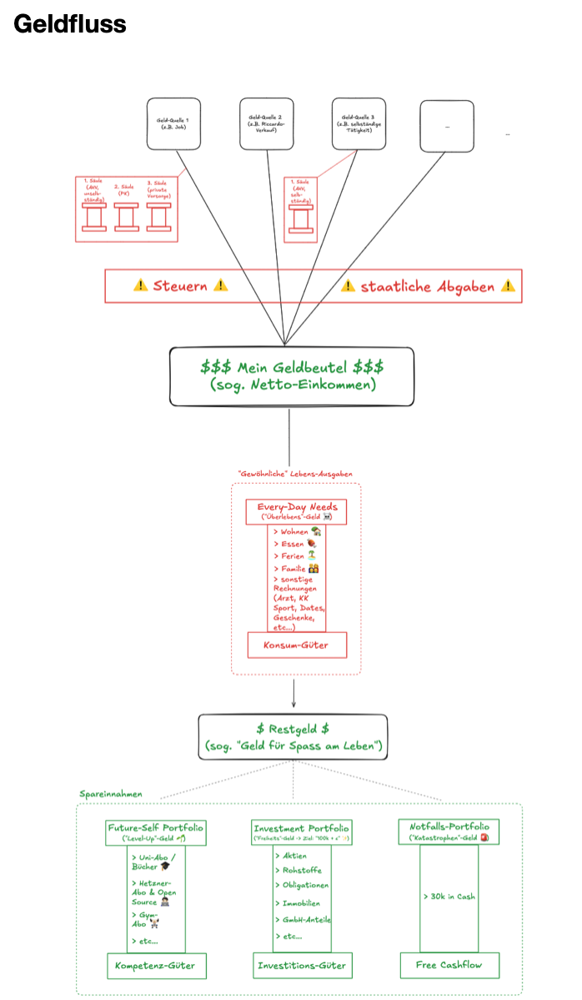
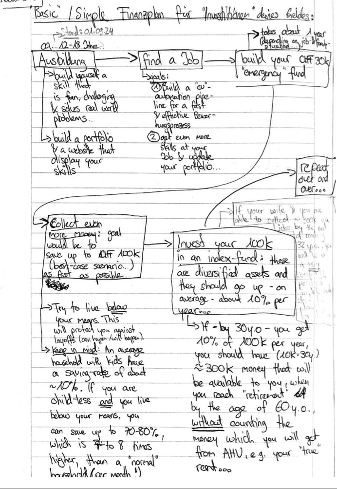

# Investments

Hier geht es um das Tabu-Thema der Gesellschaft: **Geld** und - insbesondere auch - dessen Verwaltung. 

**Geld ist ein Freieheisinstrument: wenn du weisst, wie du mit deinem Geld vernünftig umgehen sollst, wirst du dir Zeit zurückkaufen, die du sonst in Arbeit (selbständig oder unselbständig) stecken musst, um zu überleben.**

## Haushalt- & Budgetsplanung

Bevor du mit "Investments" beginnst, musst du wissen, was du überhaupt an Geld ein- & ausgibst. 

### Die "Geld"-Architektur

Hier eine Übersicht, wofür du - grob - alles dein Geld benötigst:

## Herleitung deiner Investment-Strategie

Nachdem du weisst, wie Geld jeweils verwendet wird und wann dieses aus deinem Portemonnaie herausfliesst, gilt es nun, eine (simple!) Investment-Strategie herzuleiten.

### Wo soll ich beginnen? | Reihenfolge

Hier die Übersicht, wie du **dein Leben mit einer (simplen) "Investment-Strategie" in Einklang** bringen kannst:

### Grobe Faustregeln, die es *immer* zu respektieren gilt?

- Investieren *niemals* dein ganzes *Vermögen* in rein spekulative Anlagen (z.B. "Bitcoin" in den 2020er Jahren).
- Versuche *immer*, **deine Investments zu diversifizieren**, also z.B. 60% deines Investment-Vermögens in Rohstoffe, 30% in Aktien und 10% in Bonds. Es gibt einen Grund, weshalb die **Diversifikations-Theorie** (Markowitz) den Wirtschafts-Nobelpreis erhalten hat.

### Deine Investment-Ziele

***Bevor*** du mit der Investement-Strategie beginnst, beantworte folgende Leitfragen:

- <u>Gegeben deiner aktuellen Lebenssituation (insb. Alter, Familienstand & Arbeitssituation)</u>: *was ist der **Anteil an "Cash"**, der du bereit bist, in dein Investment-Portfolio zu stecken?*
- *Wie viel Geld soll dein Portfolio umfassen, bis du "zufrieden" bist und - theoretisch - niemals mehr in der Lage wärst, zu investieren (damit du dich auch um die **wirklich** wichtigen Dinge im Leben kümmern kannst, wie z.B. Kinder erziehen & Familie, Hobbies & Gesundheit)?*

### Methodik 

Am besten geht das, wenn du jeweils **1x jährlich deine Finanzen vom _vergangenen_ Jahr** Revue passierst.

Hier das Video (_lokaler_ Pfad):

`./Documents/Life/03 Investment/1-Haushaltsplanung/1-yearly-budget-simulation/How to Monitor your Yearly Costs of Living & derive a meaningful and adequate Investment-Strategy?.mov`

#### Du investierst zum ersten Mal in die Aktienmärkte?

Dann solltest du überlegen - via deinem Bauchgefühl & das Verfolgen der Tagesschau - ob die *generelle Marktstimmung* aktuell eher "gut" oder "schlecht" ist. 

Hier die Faustregel, an der du dich orientieren kannst, *nachdem* du deine "gut / schlecht" Einschätzung gemacht hast:

- <u>Falls "gute Marktstimmung" herrscht</u>: Finde einen Index, in dem du dein Geld investierst (z.B. der S&P500).
- <u>Falls "schlechte Marktstimmung" herrscht</u>: Investiere lieber in Anlagen, die eine Reputation haben, "Krisenresistent" zu sein.

## Trends & Markt-Prognosen | Die Aussenperspektive des Marktes

*Nun, da du das **einmalige** Set-Up durchgegangen bist, kannst du nun beginnen, dich mit allgemeinen Marktprognosen zu beschöftigen. Sie geben dir Indikatoren, wo aktuell die Aufmerksam der Finanzmärkte liegen und erlauben dir - relativ dazu - deine eigene Meinung zu bilden und dich auf dem Märkten zu platzieren.*

### AI & Künstliche Intelligenz Trend

In [diesem Artikel von Cyril Jubert (Februar 2026)](https://or.fr/actualites/pourquoi-lor-minieres-surperforment-reste-marche-3680) werden sehr viele "meta-level" Aspekte der Software-Entwicklung und den Einfluss von AI darauf, sowie auf das "Software-as-a-Service" (SaaS) Business-Modell und die Finanzmärkte.

Hier die interessantesten Passagen:

- „Dans un monde où un agent IA traite les données, génère les exports et prépare les audits, l’entreprise peut n’avoir besoin que d’un nombre limité de licences pour validation et supervision finale. 
   - <u>Beurteilung von mir (= Effekt von AI auf Software-Lifecycle)</u>: 100% d‘accord. Je suis mes profs de l‘uni sur Twitter et ils disent la même chose: si la „génération“ de code devient „gratuit“ à cause de la technologie „chatGPT“, alors la „valeur“ ajoutée des cocos qui produisent le code va aller dans la „validation & supervision“. Et ici, le monde aura toujours encore besoin d‘experts, car - comment l‘exemple que je t‘ai montré avec les images de maintenance de rous de trains - il faudra alors détecter l’anomalie dans le code générer automatiquement par les robots (grace à un expert). 
- ⁠“Si une IA peut recréer 70 à 80 % de ces fonctionnalités en interne, à moindre coût et avec une personnalisation plus fine, la pression concurrentielle devient immédiate. La barrière d’entrée logicielle s’effondre.“
    - <u>Beurteilung von mir (= Unlösbarer Wartbarkeitsaspekt im AI-Regime wegen IT-Infrastruktur & Software-Umgebungen)</u>: je suis d‘accord aussi, mais avec la nuance suivante: il faut toujours encore - dans une seconde phase (plus long terme) - un coco qui arrive à faire marcher le système informatique crée par l‘IA. Le coco doit aussi comprendre le système entier générer par l‘IA, car sinon, comment peut il faire marcher son entreprise sans bugs informatique? —> tu peux penser à toi et nos pages html: il y a pleins de petits „truques“, qu‘il faut savoir pour faire marcher notre site. Ici, l‘IA peut bien sûr t‘aider, mais cela implique souvent aussi qu‘un „expert“ donne les bonnes instructions à l‘IA pour qu‘elle puisse faire son travaille correctement. Mais  je suis néanmoins d‘accord que l‘IA est  un accélérateur formidable de l‘innovation. Pour des mecs perfectionnistes comme nous, elle peut nous ouvrir pleins de possibilité qui aurait été beaucoup trop couteuse à entreprendre, si on avait pas d‘IA. C‘est là que je pense que beaucoup de gens „non-initier“ & managers on pas encore compris la chose: il pense pouvoir éliminer complètement les humains des processus de création, mais c‘est l‘inverse qui est vraie: la synnergie „robot“ + mecs perfectioniste ouvrira un monde avec des produits / innovations crées par des équipes „d‘experts“ beaucoup plus petits.
- ⁠“Cette première commoditisation que nous avons décrite ne menace donc pas seulement les modèles d’affaires des éditeurs. Elle remet en question l’architecture financière qui s’est construite autour de la stabilité supposée du SaaS.

C’est là que l’enjeu devient systémique. Lorsque la technologie modifie la visibilité des flux futurs, elle modifie aussi la perception du risque de crédit. Et lorsque le crédit se reprice, ce n’est plus un simple ajustement sectoriel, mais un changement de régime.“ 
    - <u>Meine Beurteilung (AI-Effekt auf Finanzsystem insbesondere im SaaS-Bereich)</u>: voilà un point auquel je n‘avais j‘avais encore pensé, mais que je trouve très intéressant. Est-ce que la crise mondial peut venir des changements systèmiques de la productions de logiciel informatique? Si beaucoup d‘entreprise „tech“ sont financer à des leviers de detes élever, nous avons trouver le candidat & cause de la prochaine crise financière. 
-  „Parallèlement, plusieurs acteurs chinois — tels que DeepSeek ou MiniMax — ont accéléré la convergence en s’appuyant sur des techniques de distillation et d’itération rapide. La logique est simple : observer le comportement des modèles frontier, entraîner des modèles plus compacts capables d’en reproduire une large partie des performances, puis les distribuer à coût marginal faible. La barrière à l’entrée ne disparaît pas, mais elle se réduit. [….] 
Nous entrons alors dans un monde hybride : l’IA locale traite les flux internes, les audits, les documents sensibles ; seuls les cas complexes, multimodaux ou nécessitant une puissance exceptionnelle remontent vers le cloud. La dépendance aux API centralisées diminue. Le pricing power des fournisseurs frontier se fragilise. […]
Et c’est ici que la seconde commoditisation devient stratégique. Si la majorité des usages quotidiens bascule vers des modèles open-source ou localisés, la rente ne se situe plus dans la simple exécution du modèle. Elle se déplace vers l’orchestration, la donnée propriétaire et l’infrastructure.“
    - <u>Meine Beurteilung (= AI-Regime beschleunigt vor allem den digitalen Innovationsprozess, dh Software von 0->1 & die Bedeutung von lokalen Open-Source Modellen)</u>: là aussi, je suis d‘accord à 100%. Les gagnats des grands changements seront les entreprises qui arriveront à implémenter ces programmes open source dans tous leurs processus de créations (qui seront accélérer à cause de l‘automatisation dûe à l‘IA). C‘est là ou on pourra voir l‘aparition d‘entreprise très petites tailles avec des gens qui deviendrons milliardaires.

