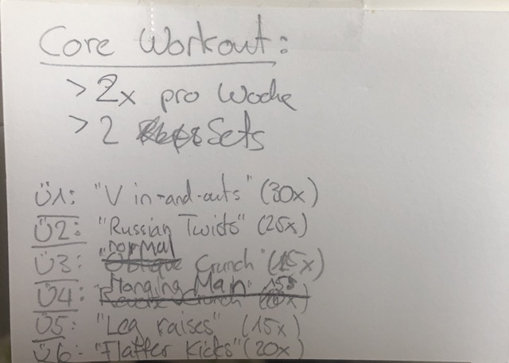
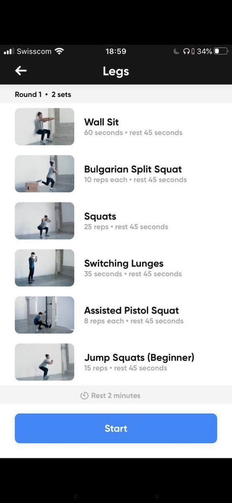
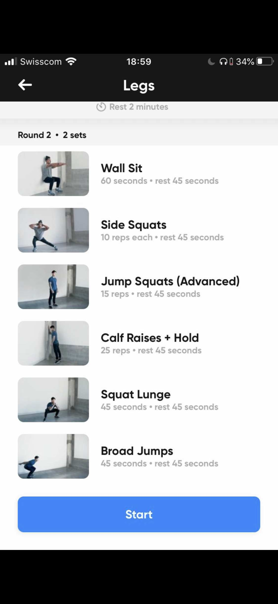

# Sport

> Entretenir son corps est un devoir, une obligation envers soi-même, envers les autres, envers la vie (Jean Cianti, 1994).

Dein Körper gibt es nur ein Mal. Ohne ihn, kannst du kein Geld oder jegliche andere Dinge im Leben erledigen. Um den Alterungsprozess des Körpers vorzubeugen, ist es deshalb von höchster Wichtigkeit, dass du regelmässig Sport treibst.

*Als Konsequenz wirst du nicht nur gesünder & (theoretisch) ein längeres Leben führen können, sondern auch höhere Willenskraft & Resilienz erlangen, sowie mehr Energie haben.* 

## Ernährung | Notwendige Hintergrund Infos

### Kapitel Kalorien, ATP & Energiebilanz: 

- Definition Kalorien = Masseinheit für  Energie
- kcal = Kilokalorien —> Ein Apfel hat ungefähr 65 kcal
- Jedes Nahrungsmittel ist aus unterschiedlichen Nährstoffen zusammengesetzt (Kohlenhydrate, Proteine und Fette).
    - Mithilfe der ganzen Nährstoffe stellt der Körper ATP (Adenintriphosphat) her. —> Bewegungen, Reparationen im Körper etc.. —> Alles(!) funktioniert durch ATP (wie Benzin oder Währung des Körpers)
    - Die Energiebilanz = Energie   rein – Energie raus
        - Falls Positive Energiebilanz: Körper speichert diese überschüssige Energie meist in Körpergeweben —> Zunahme ist die Folge
            - Die Kunst beim Muskelaufbau ist es, viel Muskeln aufzubauen bei gleichzeitig geringer Fettzunahme. —> man braucht zwingend eini positive Energiebilanz
        - Falls negative Energiebilanz: Um den Bedarf an Energie zu decken, bedient sich der Körper an seinen Speichern (wie Fett oder Muskeln) —> Abnahme ist die Folge
        - Beispiel: Der Tagesenergieverbrauch eines Mannes bei mittlerer Aktivität liegt um die 2500 kcal. —> dadurch kann man nun leicht berechnen, wie viele Kalorien man benötigt um eine positive Energiebilanz aufzuweisen. 
    - Wie kJ in kcal umrechnen?
        - Dividiere den kJ Wert durch 4,19 und du bekommst die Energie in kcal.

### Kapitel Proteine, Kohlenhydrate & Fette:

- Definition Makronährstoffe = Das sind Kohlenhydrate, Proteine und Fette
- Kohlenhydrate (KH)
    - Kohlenhydrate kommen vermehrt vor z.B. in:
        - Brot 🥖 
        - Nudeln 🍜 
        - Kartoffeln 🥔 
        - Reis 🍚 
        - Früchten 
        - etc...
    - Aus Kohlenhydraten kann dein Körper „am einfachsten“ Energie gewinnen. Wenn schnell & viel Energie bereitgestellt werden muss, sind Kohlenhydrate das Energiesubstrat Nr.1.
    - Gute Faustregel: Je höher dein Trainingsvolumen und deine Trainingsintensität desto mehr Kohlenhydrate benötigst du, um leistungsfähig zu sein
    - Für den Muskelaufbau empfehlen wir 3-6 g / kg Kohlenhydrate.
    - Meistens sind Kohlenhydrate Zuckermoleküle, die in unterschiedlicher Weise aneinandergereiht sind. Weitere Kohlenhydrat-Formen sind Stärke und Ballaststoffe.
- Protein
    - Proteine sind Baumaterial und gleichzeitig auch Auslöser für den Aufbau von Muskeln
    - Proteine kommen häufig vor z.B. in:
        - Fleisch 🍖 
        - Fisch 🐟 
        - Eiern 🍳 
        - Milchprodukten 
        - Tofu
        - etc...
    - Synonym für Protein = Eiweiss
- Fette
    - Fette werden in 2 Unterkategorien eingeteilt: gesättigte Fette (nicht so guter Ruf) & ungesättigte Fette
        - Gesättigte Fette kommen z.B. vor in:
            - Eier 🍳 
            - Quark
            - Butter
            - Käse 🧀 
            - Fettes Fleisch 🍖 
        - Ungesättigte Fette kommen z.B. vor in:
            - Avocado 🥑 
            - Olivenöl 
    - Sie spielen beispielsweise eine große Rolle für die Struktur der Zellwände, bei der Bildung vieler Hormone (Testosteron, Östrogen und weitere) und sind nicht zuletzt ein wichtiger Energiespeicher.
    - Eine Ernährung mit einem hohen Fettgehalt macht es sehr einfach, zu viele kcal zuzuführen. —> positive Energiebilanz 
    - Wird gefeiert von Low Carb-Anhängern und Paleo-Anhängern gefeiert.
    - Eine fettreiche Ernährung macht nicht automatisch dick, kann es jedoch einfacher machen, zu viel zu essen.

### Kapitel „richtige Ernährung für den Muskelaufbau“ 

- Positive Energiebilanz haben, damit Muskelaufbau überhaupt möglich ist —> sonst hilft auch das beste Training der Welt nichts! 
- Optimaler Kalorienüberschuss: 
    - Männer: ca. 300-500 kcal
            * Als männlicher Natural sind 300 – 500kcal Überschuss pro Tag ein guter Richtwert um den maximal möglichen Muskelaufbau zu unterstützen. Mit 39 kcal/kg kommt man ungefähr auf diesen Wert. 
            * Jo: 39 kcal/kg * 63kg = 2457 kcal
    - Frauen: ca. 150-250 kcal Überschuss
        * Frauen müssen ca. nur halb so schnell Muskelmasse aufbauen, deshalb nehme ich hier 19.5 kcal/kg
            * Vi: 19.5 kcal/kg * 54kg = 1053 kcal
- Optimaler Anteil an Kohlenhydrate: 2 g/kg bis 6g/kg an KH (egal ob Frau oder Mann)
    - Die benötigte Menge hängt stark von Trainingsvolumen, Intensität und Art des Trainings ab. 
    - Für Athleten, die KH nicht so gut verkraften, ist ein Minimum von 150g/Tag angeraten mit hauptsächlicher Zufuhr direkt nach dem Training.
- Optimaler Anteil an Proteine: —> wichtigstes Bauelement!
    - Männer: 1.5-2.5 g/kg
    - Frauen: 1.4-2.2g/kg
    - Am besten 2g/kg empfohlen
- Optimaler Anteil an Fett: 1 g/kg bis 3g/kg an Fett (egal ob Frau oder Mann)
    - Korreliert meist negativ mit der Kohlenhydratzufuhr. —> dh je mehr KH man zu sich nimmt, desto weniger Fett (und vice versa: je mehr Fett, desto weniger KH) —> Wer weniger Kohlenhydrate verträgt, steigert seine Fettzufuhr.
    - Ein Mindestmaß von 1g/kg Körpergewicht sollte immer gewährleistet sein.
- Timing - Wann essen?
    - Energie (=Nahrung) - vor allem an Trainingstagen - um das Training herum zuführen.
    - Der größte Teil sollte nach dem Training zu sich genommen werden, da der Körper in dieser Phase am aufnahmefähigsten für verschiedenste Nährstoffe ist.
        - Vor allem Kohlenhydrate und Eiweiß können in dieser Zeit verstärkt in die Muskulatur eingelagert werden, was die Proteinsynthese sowie die Wiederbefüllung der Glykogenspeicher fördert. —> gute Strategie dabei: Postworkout-Shake direkt nach dem Training zunutze, gefolgt von einer ausgewogenen Mahlzeit 1-2h
        - Merke aber: hitting your daily macronutrient targets is FAR more important than nutrient timing

### Kapitel Körperfettanteil (KFA):

- Definition Körperfettanteil: Der Körperfettanteil gibt an, wie viel Prozent des Gesamtkörpergewichts aus Fettmasse besteht.
    - Beispiel: Hat beispielsweise ein 100 kg schwerer Mensch 20 kg Fett auf den Rippen, so spricht man von einem KFA von 20%.
- Der KFA ist wichtig weil:
    - er eine Orientierung bietet, ob du lieber abnehmen oder aufbauen solltest.
    - der KFA stark deine der KFA stark deine hormonelle Lage beeinflusst (bspw. Leptin).
- Körperfettanteil bestimmen: mit Hilfe von Bildern (Jo: ca. 13% & Vi: ca. 19-20%) oder mit Hilfe des Rechners auf ihrer Seite: https://fitness-experts.de/grundlagen/kfa-koerperfettanteil
    - 10-15% (Männer) und 18-23% (Frauen) ist der Bereich, den die meisten anstreben —> das haben wir schon! xD
- KFA reduzieren: Die Veränderung deines KFAs nach oben oder unten geschieht hauptsächlich über eine Vergrößerung oder Verkleinerung deiner Fettzellen (Adipozyten).

### Kapitel Stoffwechsel:

- Definition Stoffwechsel: Unter dem Stoffwechsel (oder auch Metabolismus genannt) versteht man die Gesamtheit aller chemischen Vorgänge im Körper. —> in der Fitnessbranche wird allgemein unter dem Stoffwechsel der Kalorienverbrauch verstanden.
    - Ein schneller Stoffwechsel wird mit einem hohen Kalorienverbrauch gleichgesetzt.
    - Ein langsamer Stoffwechsel mit einem niedrigen Energieverbrauch.
- Wieso ist der Stoffwechsel wichtig im Fitness? 
    - Im Wesentlichen dient der Stoffwechsel dem Aufbau und der Erhaltung des Körpergewebes (bspw. Muskeln, Leber etc.), der Aufrechterhaltung von Körperfunktionen (Körpertemperatur, Herzschlag etc.) oder der Energiegewinnung (ATP-Produktion). Diese Prozesse benötigen alle Energie. —> Viele wollen den Stoffwechsel anregen (—> weil dadurch schneller Muskeln gebildet werden) oder haben Angst vor dem Stoffwechsel auf Sparflamme.
        - Fazit: man kann den Stoffwechsel beeinflussen und steuern! —> dabei muss man wissen, wie der Gesamtenergieverbrauch eines Menschens zusammengesetzt ist.
            - Gesamter Energieverbrauch = RMR + TEF + TEA + NEAT
                - TEF & RMR können nicht wirklich beeinflusst werden, deshalb unwichtig
                - TEA – Thermic Effect of Activity: Kcal, die du für bewusste Bewegungen (Training, Sport) benötigst. Wichtige Unterform: NEAT – None Exercise Activity Thermogenesis: Kcal, die für alle unbewussten Bewegungen benötigt werden (Herumlaufen, Putzen, Herumzappeln, Aufräumen, Arbeit etc.)
    - Stoffwechsel beschleunigen (= Kalorienverbrauch erhöhen [in Fitnessprache]): Du kannst in fast allen Bereichen Änderungen vornehmen: Ernährung, Bewegung, alltäglichem Lebensstil, Supplements etc.

### Basics: 

- Eiweiss // Protein: 1,5 – 2,5 g/kg (Männer) bzw. 1,4 – 2,2 g/kg (Frauen) —> Protein (wie viel Training?, kcal Defizit?, Körperfettanteil?)
    - Beispielrechnung zu Protein: Du wiegst 75 kg und willst 2 g/kg Protein zu dir nehmen?
    - Rechnung: 75 kg * 2 g/kg = 150 g. Das ist die Menge an reinem Protein.
    - Lebensmittel für Zufuhr von (hochwertigem) Protein: 
        - Linsen
        - Magerquark
        - Kidneybohnen
        - Käse & Mozarella
        - Mandeln
        - Erdnüsse
        - Sojamilch
        - Fisch
        - Kichererbsen
        - Lupinen
        - Poulet
        - Whey Protein(?)
    - Ein Mix aus unterschiedlichen Nahrungsmitteln sollte das angestrebte Ziel sein, um die Vor- und Nachteile der Eiweißquellen auszugleichen..
    - Wie viel Protein ist optimal? —> für Kraftsportler ca. 1.8g/kg (bi mir: 62.9kg * 1.8g/kg = 113g Protein)
    
## Das eigentliche Training 🏋♂️ 

### Kaufen 

- 4x 1kg Gewichte, 1x Kurzhantel mit gutem Stopper

### Definitionen & Erklärungen

- Volumen (Sätze x Wdh.) —> Das wird jedoch erst im fortgeschrittenen Stadium für dich wichtiger
- Grundübungen sind Kniebeugen, Kreuzheben, Bankdrücken, Schulterdrücken und Rudern. —> Grundübungen sind Zeit – & Energie – effizient. Mit Grundübungen trainierst du sehr viel Muskelmasse auf einmal. —> So entwickelt sich deine Muskulatur viel eher ausgeglichen, als nur mit Isolationsübungen. 
- Maschinen isolieren häufig einzelne Muskelgruppen.

### Einwärmen via Stretches

- Try these 5 stretches: https://youtu.be/WL6VSc5XQ-8?is=VMIyEQ2E1v9Ld3QV

## Work-Outs

### Core Workout (Beginner)

Hier das bi-weekly Core-Workout zum Start:

### Upper Body

- Kleine Hanteln Gewicht: 2 * 3.5 kg = 7kg —> (1kg + 1kg + 1kg + 0.5kg) ODER (1.25kg + 1.25kg + 1kg)
- Brust Gewicht:  2* 9.25kg = 18.5kg     —> (5kg + 2.5kg + 1.25kg + 1kg)*2
- Bizeps Gewicht: 2 * 8.25kg = 16.5kg —> (5kg + 1 kg + 1kg + 1.25kg)

### Beintraining

#### 1st round

#### 2nd Round

## Pausen vom Sport

### Muskeln behalten

- Eiweiss // Protein: 2,0-3,0 g/kg (Männer) bzw. 1,7-2,6 g/kg für Schutz vor Muskelverlust 
