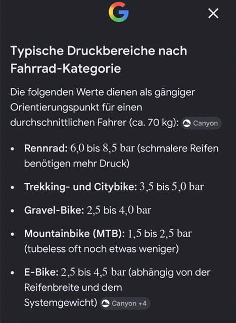
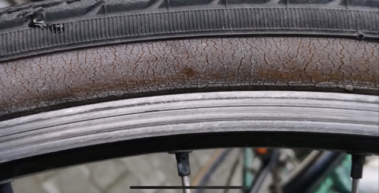

# Mobilität

Hier geht es um das Thema: Mobilität.

Der **Fokus liegt hier auf Verkehrsmittel, die du besitzen kannst**, wie z.B. ein öV Abo, ein Auto oder ein E- Bike. 

Das **Flugzeug wird <u>nicht</u> thematisiert**, sondern [im **"Ferien"-Kapitel**](https://joffreymayer.github.io/haushalt/ferien.html).

## Fahrrad

### Betrieb

Du hast ein Velo gekauft: grautliere! Nun gilt es zu wissen, wie du es **pflegst, damit es die maximale Lebensdauer besitzt**.

Hier eine Liste an **Werkzeuge, die nützlich sind für die Pflege eines Fahrrads**:

- Velopumpe
- ...

#### Wie viel Druck benötigt ein Reifen *generell*?

Das **hängt vom Fahrrad-Typ ab**. 

Hier eine Übersicht zu den verschiedenen Richtwerten pro Fahrrad-Kategorie:

#### Wie viel Druck benötigt *meine* Fahrrad-Reifen?

**Auf dem Reifen selbst sollte immer stehen, wie viel Luftdruck vom Hersteller empfohlen wird.**

- <u>Automation</u>: **1x im Monat die Reifen prüfen**, denn sie können bis zu 1Bar Luftdruck verlieren.

#### Warnzeichen, ab wann du dein Reifen auswechseln solltest?

Wenn er so aussieht 👇

- <u>Quelle (Youtube-Video einer Fahrradwerkstatt (2018))</u>: https://youtu.be/CUNFJGb02P0?is=X2zG9syt7Dtks747

