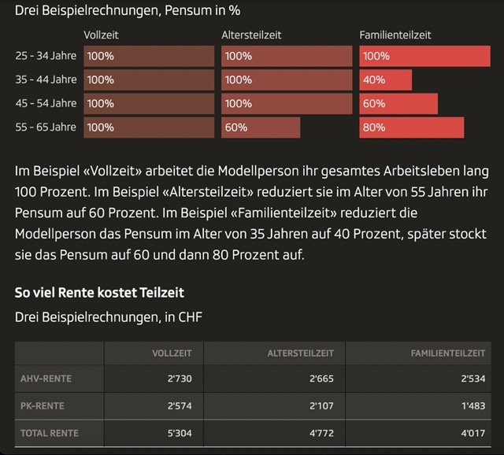

# Rente

In diesem Kapitel geht es um das Thema **Rente**: konkret auch um die **3 Säulen in der Schweiz**:

- 1. Säule: Alters- & Hinterlassenenversicherung (**AHV**)
- 2. Säule: **Berufliche Vorsorge via Einzahlung in Pensionskassen** & arbeitslosen Versicherung (ALV)
- 3. Säule: **Private Vorsorge** 

## Karriere-Effekte auf Auszahlung von 1. & 2. Säule-Renten | Szenarien-Simulationen

Es kann sehr frustrierend & intransparent sein, wenn du als junger Erwachsener zwischen 18-30 Jahren nicht konkret weisst, wie viel Rente du in Zukunft ausbezahlt haben wirst. Wie will ein Mensch vernünftige Entscheidungen treffen, wenn er nicht einmal weiss, was er konkret für ausbezahlte Renten zu erwarten hat?

Genau mit dieser Frage, hat das [ Vermögenszentrum](https://joffreymayer.github.io/haushalt/allgemeine-administration.html#verm%C3%B6genszentrum) versucht zu beantworten, indem sie folgende 3 typische (hypothetische) Karriere-Szenarien miteinander verglichen haben: 

1. Immer 100% arbeiten.
2. Im späteren Arbeitsleben von 100% auf 60% reduzieren.
3. Familiengründung mit Pensumsreduktion auf 40% und anschliessendes progressives Hochfahren auf 60% und dann 80%.

Im unteren Screenshot siehst du die resultierenden Renten aus 1. Säule (AHV) und 2. Säule aus den drei "simulierten" Karriere-Szenarien:

- <u>Quelle (SRF & Vermögenszentrum, 2026)</u>: https://www.srf.ch/news/wirtschaft/debatte-um-teilzeit-wer-teilzeit-arbeitet-bekommt-deutlich-weniger-rente
