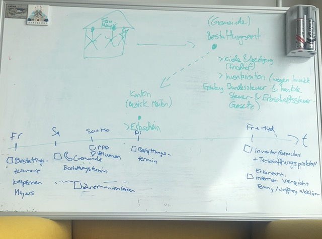

# Letzte Lebensphase & Tod

Im Leben geht es - letztlich auch - um die **Tabu-Themen: letzte Lebensphase, Tod & Erbschaft**, ob man es will oder nicht. 

*In diesem Kapitel wird beschrieben, was passiert, wenn jemand stirbt (**in der Schweiz**!) und welche Implikationen dies besitzt.*

## Welche zwei Arten von Tod gibt es?

Grunsätzlich gibt es drei unterschiedliche "Schweregrade*, wie du sterben kannst:

1. **Natürlicher oder langsamer Tod** (z.B. durch Alter),
2. **Langsamer Tod durch Krankheit** (z.B. Krebs),
2. **Unnatürlicher, plötzlicher Tod** (z.B. Mord, Suizid oder Unfall).

Keine Panik: die Merheit der Leute sterben - zumindest in der westlichen Welt - an "natürlichen (Alters-) Tod" (es gibt auch Vorbeugung durch gesunde Ernährung, Sport und / oder regelmässige Arztbesuche, um die "leichteste" der drei Alternativen herbeizuführen).

## Was passiert, wenn jemand stirbt? | Grobe Übersicht des Prozesses

Unabhängig, welcher der drei Arten von Tode eintreten in deiner Familie, ist das Prozedere standardisiert und läuft in **2 (machmal auch 3) Phasen** ab.

Im folgenden sind die drei Phasen grob beschrieben:

1. <u>"Unmittelbar vor Tod"-Phase (bei schwer Kranken)</u>: diese Phase ist ausschliesslich für schwer Kranke Personen: wenn nämlich alle medizinischen Möglichkeiten ausgeschöpft wurden, gelangt der sterbende Patient in die sogenannte **palliativ Station**, wo es ausgebildete Fachkräfte gibt, welche eine Person in ihrer letzten Wochen **würdevoll** begleitet. Wichtig auch zu wissen ist, dass diese Spital-Station auch mit besonderen "Pflege-Instrumenten" ausgestattet ist, um dem Patienten möglichst viele Schmwerzen zu verhindern (spezielles Bett, das Medikament Morphin, etc...).
  - Hier ist zu beachten, dass es einige "skurrile" Gespräche mit dem medizinischen Personal geben kann ("You are going to die", sowie "Im Spital sterben VS. zu Hause sterben", etc...)
  - Und natürlich gibt es auch den Moment, in dem die nahestehende Person von dir geht. Das kann sehr belastend sein für eine Familie, aber - aus der Sicht des Sterbenden - auch beruhigend. 
2. <u>"Unmittelbar nach Tod"-Phase (Verabschiedung via Kremation oder Beerdigung)</u>: **Unmittelbar nach dem Tod**, muss die engste Familie relativ rasch entscheiden, ob der/die Verstorbene(r) beerdigt oder kremiert wird. Zudem müssen hier alle Bekannten / der restliche Familien-Kreis informiert werden, inklusive einer Abdankung (via z.B. Gottesdienst oder kurze Verbschiedung in einer Kapelle) und einem Apéro / Restaurant-Essen.
3. <u>"Spätere Tod"-Phase (Adiministration & Erbschaft)</u>: **In den späteren Monaten** wird auch die **gesetzliche Instanz aktiv** und z.B. wird eine Inventarisationsverfahren eingeleitet (wer erbt was?), sowie andere administrative Themen, die ***von den Erbfolgen (i.d.R. Kinder oder Eltern bzw. Geschwister)*** erledigt werden müssen, wie zum Beispiel, dass alle "betrieblichen" Bank-Konten der verstorbenen Person geschlossen werden müssen, sowie laufende Verträge (Miete, Arbeitsvertrag, Handy-Vertrag, Krankenkassen-Verträge, etc...). 
  - Grosses Aufpassfeld hier ist, dass der/die Verstorbene(r) auch **Schulden** hinterlassen kann (in Form von z.B. Spielschulden, Hypotheken, kruzfristige Kredite, etc.). Entsprechend kann - im Zweifelsfall - das Erbe auch abgelehnt werden.
  
### Todesfall: die offizielle, genaue Wegleitung im Detail (inkl. zeitlicher Verlauf)?

Der obige (grobe) Prozess ist [hier - anhand des Hombi-Beispieles - nochmals im Detail erklärt](https://www.hombrechtikon.ch/public/upload/assets/4372/Wegleitung%20Todesfall.pdf?fp=1742307036272).

## Welche Behörden & Instanzen werden bei Todesfällen aktiv? | Die staatliche "Todes-Architektur"

Hier eine **empfohlene Reihenfolge**, in der du in Kontakt treten solltest mit den unterschiedlichen Dienstleistungs-Träger bei Todesfällen:

- Spital (falls Krank oder alt),
  - <u>Output</u>: Totenpflege, Koordination mit Bestattungsamt für Totenlagerung, ärztliche Totenbescheinigung.
- Bestattungsamt **des Todesortes**,
  - <u>Output</u>: Totenlagerung, letzte Abschiedsmöglichkeit für ca. 2h.
- **Wohngemeinde** des Verstorbenen,
  - <u>Output</u>: Koordinations mit Pfarramt der Gemeinde.
- Grabstätter / Verkäufer von Grabstein / Urne,
  - <u>Output</u>: Urne oder Grabstein für Verstorbener.
- Krematorium (falls der Verstorbene eine Feuerbestattung wollte)
  - <u>Output</u>: Asche des Verstorbenen in Urne tun.
- Pfarramt der Kirche **für spirituelle Abdankung (z.B. via Gottesdienst)**.
- Restaurant (nach geistlicher Abdankungsfeier),
  - <u>Output</u>: Ort der Zusammenkunft nach kirchlichem Abschied des Verstorbenen.
  - <u>Aufpassfeld (und potentiell hoher Kostentreiber, wenn das nicht genauer abgeklärt wird)</u>: Das Restaurant muss **ganz genau** wissen, wer kommt (und *nicht* "ungefähr 80 Personen"). Dh dein Job ist bei JEDER Person nachzufragen, ob sie kommen oder nicht, sonst muss das Restaurant davon ausgehen, dass die maximale Anzahl an Personen kommen (bei Mam waren das 70).
- Florist für die Blumen,
  - <u>Output</u>: Blumen für die Abdankung / Gottesdienst.
  - <u>Output</u>: Ort der Zusammenkunft für Abschied.
- Druckerei (für Abdankungs-Briefe),
  - <u>Output</u>: Kauf der Einladungen für die Einladung an die Beerdigung / Abdankung.
- Post (für Versand der Briefe).
  - <u>Output</u>: Versand der Einladungen für die Beerdigung / Abdankung.
- Notar (für Testamente oder sonstige Beratung hinsichtlich bestehender Ehe- & Erbverträge),
  - <u>Output</u>: Bescheinigung der rechtlichen Dokumente & Testament-Validierung.
- Zivilstandamt **des Todesortes** (Bundes-Ebene),
  - <u>Output</u>: amtliche Totenbescheinigung (Todesurkunde).
- **Gemeinde vom Geburtsort** des Verstorbenens.
  - <u>Output</u>: Geburtsurkunde des Verstorbenen.
- **Gemeinde vom Geburtsort** vom Verwittweten.
  - <u>Output</u>: Geburtsurkunde des Verwittweten.
- **Gemeinde vom Heiratsort**.
  - <u>Output</u>: Heiratsurkunde.
- Steueramt **der Gemeinde**,
  - <u>Output</u>: Organisation des Inventarisierungsverfahren & Tresoröffnung.
- Berzirksgericht **vom Kanton** des Verstorbenen,
  - <u>Output</u>: Beratung & gesetzliche Finalisierung der Erbschaft.

### High-Level Roadmap hinsichtlich Behörden bei Tod?

Hier unsere damaliger Ausganszustand, **<u>nachdem</u> das Bestattungsamt in ZH die Gemeinde Hombi** über den Todesfall von Mam informiert hatte:

